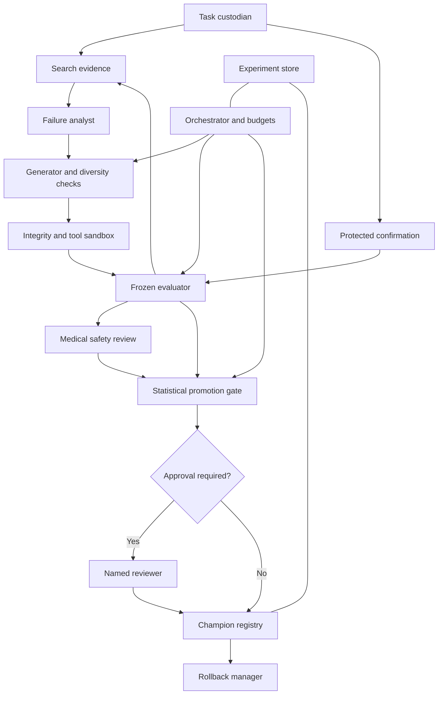

# Research report: a self-improving health skill for a frozen learner

**Research and code audit date:** 19 September 2026.
**Repository snapshot:** `richard7ao/self_improving_agent`, `main` at `f71834823dcd8e970bdc3b02c95d9d9ba2b5642a`.
**Public dataset snapshot inspected:** `armin-aptura/skilltrainbench-public` at `9d6f3a635bd9464d1930516215c760b2ebc213cd`.
**Scope:** architecture research, source inspection, existing offline tests, and illustrative statistical calculations. No paid benchmark inference, skill modification, or deployment was performed.

The greenfield design was recorded before inspecting the implementation. Recommendations below are proposals unless explicitly marked as implemented or measured. Engineering estimates assume one engineer familiar with Python and asynchronous services; they exclude clinician availability and external review time. A percentage point means `0.01` on the score scale.

## 1. Executive summary

**Verdict: retain the evaluation infrastructure; redesign the evidence required for promotion.** The repository already has an autonomous skill optimizer. It is a working research prototype with useful execution safeguards, but it does not yet establish that its promoted skills generalize better. Replacing it with a larger agent population would spend more credits without resolving that problem.

The task is to discover a small instruction package that improves a fixed learner's decisions on unseen health conversations. Success means a reproducible improvement under the frozen competition contract, with no observed critical safety regression and an auditable explanation of what changed. It does not mean improving model weights, acquiring clinical competence, or proving a deployed medical product safe.

The unusually strong parts are the controlled evaluation arms, preservation of fractional rewards, explicit handling of invalid grading, separate learner and grader token accounting, retention of trajectories, constrained candidate layout, and a functioning generate–evaluate–promote loop. These are substantial foundations. The latest optimizer requires both a positive change in the reused tune-plus-validation average and a strict validation-score gain. This is an improvement over the brief's description, but neither condition accounts for uncertainty. [Optimizer implementation](https://github.com/richard7ao/self_improving_agent/blob/f71834823dcd8e970bdc3b02c95d9d9ba2b5642a/src/skilltrainbench/optimize.py), [evaluation implementation](https://github.com/richard7ao/self_improving_agent/blob/f71834823dcd8e970bdc3b02c95d9d9ba2b5642a/src/skilltrainbench/evaluate.py).

The five most serious risks to genuine generalization are:

1. **Selection noise is treated as improvement.** Three candidates normally compete on six tune tasks, followed by two validation tasks; the stored incumbent is not freshly matched. The default threshold is zero and no uncertainty gate is applied.
2. **Validation becomes another optimization signal.** The same public split is reused across rounds. The latest strict-validation rule blocks measured validation losses, but repeated selection can still overfit this small partition.
3. **Average reward can conceal dangerous behavior.** There is no separate clinical harm gate, and detailed verifier evidence is not consumed by the reviewer.
4. **Task-derived rules can become memorization.** A substring filter and a prohibition in a prompt cannot establish semantic generalization or prevent indirect rubric encoding.
5. **The evidence base is small and imperfectly representative.** The published dataset currently contains 200 health task folders, all named `healthbench-hard-*`; exact exposure history and private-holdout composition are unavailable. Judge error, dataset adaptation, and provider drift compound this limitation. [Pinned dataset tree](https://huggingface.co/datasets/armin-aptura/skilltrainbench-public/tree/9d6f3a635bd9464d1930516215c760b2ebc213cd/healthbench/tasks).

**Can it be called self-improving?** Yes, in the procedural sense of autonomously revising and selecting its own persistent skill context. No, if the phrase implies demonstrated, durable improvement on unseen conversations. Git history contains promoted health versions, but the ignored run artifacts were not available to independently verify their measured gains. A precise description is **“an autonomous skill optimizer with training-set selection; generalization remains to be confirmed.”**

**Recommended next architecture:** a small pool of distinct, failure-driven skill edits; inexpensive racing on search data; one frozen finalist; fresh paired finalist-versus-incumbent confirmation; critical-safety vetoes; and an immutable champion registry. Use GEPA-like reflection as a proposal mechanism, not as a substitute for experimental validity. GEPA supplies relevant empirical motivation, but its reported gains are not evidence that this particular health skill will improve. [GEPA](https://arxiv.org/abs/2507.19457).

Two corrections to the brief materially affect the design:

- Individual HealthBench rewards can be **negative**. The original benchmark clips the mean, not every task. The repository preserves raw task rewards and separately reports clipped overall scores. Statistical methods assuming every task lies in `[0,1]` would be wrong here.
- A realistic initial design must fit **200 public health tasks**, not an assumed supply of thousands of fresh confirmation cases. Repeated inference reduces measurement noise; it does not manufacture new independent conversations. [HealthBench scoring, Appendix D](https://arxiv.org/html/2505.08775), [repository scoring](https://github.com/richard7ao/self_improving_agent/blob/f71834823dcd8e970bdc3b02c95d9d9ba2b5642a/src/skilltrainbench/scoring.py).

## 2. Problem definition and constraints

Let `s` denote a complete skill directory and `F` the fixed learner, harness, task limits, and official grader. We can search over `s`; we cannot improve measured results by changing `F`. Development services may analyze results or reject a candidate, but they must not supply extra inference, tools, answers, or a different grader to the scored learner.

For a task `x`, learner realization `r`, and grader realization `g`, write the raw reward as `Y(s,x,r,g)`. The immediate objective is improvement over the incumbent on unseen tasks, accompanied by positive lift over the official placebo. The final artifact must contain reusable instructions and any justified offline tools, at most 200 files and 1,000,000 bytes.

The frozen health configuration is confirmed in code:

| Contract element | Current value | Evidence / qualification |
|---|---|---|
| Learner | `zai-glm-5-3-flash` | `hackathon.toml`, `[learner]` |
| Harness | `openhands-sdk` | Same configuration |
| OpenHands version | `1.47.0` | `agent_kwargs.version` |
| Health grader | `anthropic-claude-haiku-4-5` | `[domains.health]` |
| Grader temperature | `0.0` | Not evidence of perfect determinism |
| Provider | Runware, OpenAI-compatible endpoint | `[upstream]`, `gateway.build_app` |
| Docker concurrency | 4 by default | CLI can lower it; optimizer divides slots among candidate evaluations |
| Learner token pool | 2,000,000 per `run_eval` | Shared across the arms of that evaluation |
| Grader token pool | 2,000,000 per `run_eval` | Separate from learner pool |
| Health turn/time limits | 4 iterations; 300-second agent timeout | `config.learner_settings`, `harbor.stage_task` |
| Local dependencies | Python ≥3.12, uv, Harbor, Docker, FastAPI, HTTPX | `pyproject.toml`; `uv.lock` resolves Harbor 0.22.0 and HTTPX 0.28.1 |
| Dataset revision configured | `main` | Mutable; the audit separately resolved an immutable dataset commit |

[Configuration](https://github.com/richard7ao/self_improving_agent/blob/f71834823dcd8e970bdc3b02c95d9d9ba2b5642a/hackathon.toml), [configuration loader](https://github.com/richard7ao/self_improving_agent/blob/f71834823dcd8e970bdc3b02c95d9d9ba2b5642a/src/skilltrainbench/config.py), [dependency lock](https://github.com/richard7ao/self_improving_agent/blob/f71834823dcd8e970bdc3b02c95d9d9ba2b5642a/uv.lock).

These are verified repository settings, not independently verified organizer settings. The sampled public grader configuration names the original HealthBench grader `gpt-4.1-2025-04-14` at temperature `0.5`; repository staging deliberately overrides it with the competition grader. Preserve the competition settings. Published HealthBench judge-validation results cannot simply be transferred to this Haiku-based adaptation. [Public grader configuration](https://huggingface.co/datasets/armin-aptura/skilltrainbench-public/blob/9d6f3a635bd9464d1930516215c760b2ebc213cd/healthbench/tasks/healthbench-hard-00656524-cc51-47a3-bfb5-85e7096ee1c8/tests/grader_config.json).

**Objective function.** Use constrained, lexicographic decisions rather than a single weighted safety–quality score:

1. Enforce competition integrity, tool restrictions, budget feasibility, complete evidence, and artifact identity.
2. Reject confirmed critical harm and prespecified material category regressions.
3. Require credible, practically meaningful reward improvement over the incumbent and positive placebo lift on confirmation data.
4. Among statistically indistinguishable feasible search candidates, prefer lower inference cost and simpler artifacts.

| Quantity | Optimize, constrain, or report? | Initial rule |
|---|---|---|
| Raw HealthBench mean | Optimize | Primary research endpoint; retain negative rewards |
| Skill-minus-placebo lift | Confirm and report | Must be positive with the prespecified uncertainty rule |
| Candidate-minus-incumbent gain | Promotion constraint | Lower confidence bound above `δ = 0.02` |
| Critical safety events | Hard constraint | No confirmed event in candidate audit; unresolved flags block promotion |
| Clinical subgroup performance | Guardrail | Section 7; no cross-category compensation for critical events |
| Learner tokens and latency | Budget constraint and secondary objective | Same frozen limits; flag >20% median token or p95 latency increase for explicit justification |
| Grader/optimizer dollars | Campaign constraint | Reserve before calls; count failed attempts and missing-usage reservations |
| Response length | Report | No blanket shortness reward; length is sometimes necessary |
| Skill size/complexity | Constraint and tie-breaker | Competition limits; proposed soft target ≤1,200 entry-point words and ≤5 files |
| Tool-call reliability | Constraint | No tool crash or routing failure in qualification cases; measured benefit required |
| Across-run robustness | Confirm and report | Task-clustered uncertainty; repeated outputs and worst observed failures |

The numerical soft limits are engineering defaults to test, not medically validated thresholds. An allowed package should still be rejected when its complexity has no demonstrated benefit.

## 3. Evidence from the repository

### 3.1 What was inspected and tested

The audit read every module under `src/skilltrainbench`, the configuration, lockfile, optimizer tests, methodology, teammate guide, current health skill, and its helper. The initial snapshot was `466892b`; `main` advanced during research. The final audit incorporated `ae7be07` and `f718348`, including their complete optimizer/test diff and the new finance-loop documentation. All implementation links point to the final snapshot. In particular, validation regression protection and bounded trajectory review are now implemented across optimizer domains. Repository history was fetched to inspect the health promotion commits. Public-dataset inspection covered the file inventory and one task's shared grading infrastructure; no patient conversations or answer keys were imported into this report.

The current health folder contains `SKILL.md` and `scripts/check_constraints.py`. It emphasizes continuity, bounded-task compliance, calibrated clinical language, proportionate escalation, and a form-only checker. The checker contains two self-tests, and both passed. The optimizer suite at the final snapshot contains 15 tests; all passed in an offline test process after removing inherited proxy settings that otherwise caused HTTPX to require the absent `socksio` dependency. This was an environment adjustment for mocked tests, not a source change or benchmark execution.

`stbench doctor` could not qualify live execution: Docker and API credentials were absent; no full dataset was installed; its Hugging Face check also encountered the proxy dependency issue. Therefore, this report makes no new empirical claim about live model performance, actual provider prices, or container behavior on the user's machine.

Two committed revisions are explicitly titled as promotions: [`60198ad`](https://github.com/richard7ao/self_improving_agent/commit/60198ad19c6f176c5e1ba60183cab0357056fb87) and [`502ba3a`](https://github.com/richard7ao/self_improving_agent/commit/502ba3ac43e74794f78782877497a0fdfddb6d4d). They establish that the health artifact has evolved; their titles alone do not validate the associated performance claims.

### 3.2 Implementation evidence map

All repository links below are pinned to the audited commit.

| Component | Exact functions / symbols inspected | Verified behavior |
|---|---|---|
| [Optimizer](https://github.com/richard7ao/self_improving_agent/blob/f71834823dcd8e970bdc3b02c95d9d9ba2b5642a/src/skilltrainbench/optimize.py) | `make_split`, `_task_context`, `_observations`, `_trajectory_evidence`, `_chat`, `_score`, `_aggregate`, `_should_promote`, `_replace_tree`, `run_optimization` | Fixed public tune/validation split; same model reviews and generates; skill-only evaluation; highest tune score advances; aggregate plus strict validation gain decides promotion; live replacement precedes state write |
| [CLI](https://github.com/richard7ao/self_improving_agent/blob/f71834823dcd8e970bdc3b02c95d9d9ba2b5642a/src/skilltrainbench/cli.py) | `main`, `_run` | Defaults: 3 rounds, 3 candidates, 8 tasks, 25% validation, zero minimum gain; seed controls split/generation, not learner sampling |
| [Evaluation](https://github.com/richard7ao/self_improving_agent/blob/f71834823dcd8e970bdc3b02c95d9d9ba2b5642a/src/skilltrainbench/evaluate.py) | `_attempt_with_retries`, `run_eval`, `_PLACEBO_SKILL` | Baseline/placebo/skill arms; one successful scored attempt per task–arm; infrastructure retry handling; distinct meters; `Pair(seed=0)` is a record value, not seeded learner execution |
| [Scoring](https://github.com/richard7ao/self_improving_agent/blob/f71834823dcd8e970bdc3b02c95d9d9ba2b5642a/src/skilltrainbench/scoring.py) | `summarize`, `_validate_balanced_arms`, `_cluster_bootstrap_ci`, `_clip_official` | Drops within-evaluation invalidated pairs; 1,000-resample task bootstrap from 12 tasks with a control; raw rates and separate clipped health summary |
| [Gateway](https://github.com/richard7ao/self_improving_agent/blob/f71834823dcd8e970bdc3b02c95d9d9ba2b5642a/src/skilltrainbench/gateway.py) | `BudgetMeter`, `Ledger`, `estimate_prompt_tokens`, `fetch_prices`, `build_app` | Reservation/reconciliation and fail-closed missing usage; reported cost/latency; HTTP forwarding and grader attempt tags |
| [Harbor adapter](https://github.com/richard7ao/self_improving_agent/blob/f71834823dcd8e970bdc3b02c95d9d9ba2b5642a/src/skilltrainbench/harbor.py) | `stage_task`, `build_command`, `_child_env`, `run_attempt` | Staging, skill copy, fixed agent settings, subprocess cleanup, supported egress restrictions, credential filtering |
| [Task adapter](https://github.com/richard7ao/self_improving_agent/blob/f71834823dcd8e970bdc3b02c95d9d9ba2b5642a/src/skilltrainbench/tasks.py) | `load_task`, `finite_reward`, `score`, `attempt_from_trial` | Task validation, finite raw fractional scores, inconsistent-status detection, response/trajectory locations |
| [Skill checks](https://github.com/richard7ao/self_improving_agent/blob/f71834823dcd8e970bdc3b02c95d9d9ba2b5642a/src/skilltrainbench/config.py) | `check_skill`; optimizer `materialize_candidate` | Size/file/symlink/frontmatter checks; endpoint-pattern warnings; generated candidates also reject warnings, parse Python, require named supporting paths, and scan task overlap |
| [Reporting](https://github.com/richard7ao/self_improving_agent/blob/f71834823dcd8e970bdc3b02c95d9d9ba2b5642a/src/skilltrainbench/reports.py) | `compare_results` | Ranks result directories by stored skill score without requiring matching task sets or experiment contracts |
| [Optimizer tests](https://github.com/richard7ao/self_improving_agent/blob/f71834823dcd8e970bdc3b02c95d9d9ba2b5642a/tests/test_optimize.py) | `OptimizeTests`, especially `test_loop_promotes_best_candidate_and_discards_variants` | Static checks, validation-regression and trajectory-boundary tests, plus one mocked happy-path loop; no statistical or crash qualification |

### 3.3 Audit of every suspected limitation

“Confirmed” describes source behavior, not a claim that harm or overfitting has already occurred.

| Suspected limitation | Verdict | Evidence and implication |
|---|---|---|
| Validation comes from public training data | Confirmed | `task_names` → `make_split`; locally withheld examples are not organizer-private examples |
| Same validation adaptively reused | Confirmed | `split` is created once and restored on resume; promotion feedback influences later incumbents |
| One stochastic learner/grader evaluation per candidate | Substantially correct | One scored learner episode per task; multiple rubric calls can compose that one grade; retries are not independent planned repetitions |
| Winner's curse / multiple comparisons | Confirmed design exposure | `max(scored, key=tune_score)` selects noisy maxima; no selection correction |
| Incumbent not refreshed with each challenger | Confirmed | Cached initial/promoted evaluations are reused |
| No controllable learner repetition seeds | Confirmed | Optimizer seeds enter `_chat`; Harbor runs `-n 1`; evaluator supplies no learner seed |
| Any positive default gain permits promotion | Partially correct / updated | `min_improvement=0.0` still allows tiny aggregate gains, but `_should_promote` also requires strict validation gain when validation exists; rates are rounded to four decimals |
| No interval/posterior requirement | Confirmed | Promotion is the conjunction of two point-score comparisons; ordinary scoring CIs are not used |
| Tune can offset validation loss | Outdated at final `main` | `_should_promote` explicitly rejects validation ties and regressions; the weighted aggregate still contains selection data |
| Optimizer does not directly score placebo lift | Confirmed, but not intrinsically a ranking error | `_score` runs only `skill`; a shared placebo cancels in candidate-versus-incumbent differences (Section 6) |
| No clinical/difficulty/risk stratification | Confirmed | Uniform sample and seeded shuffle; caller-supplied task lists remain possible |
| No separate critical-medical-error gate | Confirmed | No clinical safety result enters promotion |
| Average gain can hide triage/medication regression | Confirmed possibility | Neither aggregate nor validation mean is a separate clinical harm gate; no measured incidence established |
| Reviewer misses detailed verifier evidence | Partially correct / updated | `_observations` now adds bounded learner actions/tool observations via `_trajectory_evidence`, filters to tune tasks, and excludes reasoning/system fields; `verdicts.json` and a typed failure taxonomy remain absent |
| Judge bias/variance not explicitly measured | Confirmed in inspected source | No calibration experiment or repeat design; the fixed grader is not an independent safety guarantee |
| Review and generation use the same model | Confirmed | Both receive `state['model']`; default is learner model; configurable optimizer model still serves both roles |
| Diversity is requested but unenforced | Confirmed | Variant index, seed, and a diversity instruction; no duplicate or behavioral-distance test |
| No optional human/clinician promotion gate | Confirmed | `_replace_tree` runs directly after the two point-score conditions pass |
| Twelve-word overlap misses semantic copying / may overflag | Confirmed limitation | Lowercased alphanumeric windows, tune context only; boilerplate can also overlap |
| Generated scripts only receive shallow checking | Partially correct | Syntax is parsed and structure checked; the existing checker has self-tests, but the generator pipeline does not execute them or require independent behavioral/security tests |
| Optimizer calls bypass common budgets/ledger | Confirmed | Direct HTTPX `_chat`, 12,000-token output cap per call; no campaign reservation or usage accounting |
| Crash between replacement and state creates ambiguity | Confirmed | `_replace_tree` precedes `optimization.json.write_text`; two renames and temporary backup are not one transaction |
| Tests primarily mocked units | Confirmed | Fifteen optimizer tests; no paid, crash, statistical-simulation, or container qualification suite present |
| Provenance incomplete | Confirmed at optimizer/control level | No compatibility check of skill hash, code/config/dataset hash, environment, or provider revision on resume; lower-level artifacts may contain additional metadata |

### 3.4 Additional findings that should change priorities

**A. Cross-candidate missingness can invalidate the comparison.** Within one `run_eval`, invalidated pairs are excluded coherently. But each candidate is a separate skill-only evaluation. Different candidates can therefore have `skill_rate` values computed over different surviving tasks; `_aggregate` still uses the nominal split sizes. Reconstruct complete task-level pairs across incumbent/challenger evaluations before calculating promotion statistics. Do not count invalid grading as success, and do not silently average unmatched subsets.

**B. Raw negative scores and repeated rows need explicit handling.** `tasks.finite_reward` accepts finite negative values. `scoring.summarize` preserves them, while its `per_task` output sums repeated scores rather than averaging them. That is harmless for today's single-row tasks but would be misleading if repeated trials were added without redesign. The bootstrap's existing “12 tasks” threshold is a reporting switch, not a power or validity guarantee.

**C. The official placebo has a formatting intervention.** It requests visible reasoning and a final `#### <answer>` line. Keep this unchanged for competition-parity comparisons, but call the result “lift over the official placebo,” not a clean causal estimate of domain knowledge. A neutral, length-matched instruction control could be studied separately in development and must not replace the official control.

**D. “Atomic promotion” is overstated.** There is a crash window after moving the incumbent out of the live path, another after installing the candidate but before writing state, and no durable backup registry. Exception rollback handles ordinary exceptions around the second rename; it cannot make process death transactional. Resume verifies domain/path but not artifact identity or protocol compatibility.

**E. “Read-only mounted skill” is not established by this local path.** The wrapper copies the skill and passes Harbor `--skill`. The installed, lockfile-resolved Harbor 0.22.0 implementation `Trial._upload_injected_skills` uploads the directory and adds read/execute permissions; this is not an enforced read-only bind mount. The host source is isolated by copying, but container immutability should not be claimed without a permission test. Current Harbor documentation also describes upload semantics. Treat read-only behavior as an organizer contract requiring qualification, not as a verified local security boundary. [Harbor skills documentation](https://docs.harborframework.com/core-concepts/jobs/skills).

**F. Network isolation has a deliberate fallback.** `harbor.stage_task` omits allowlisting where the Docker kernel cannot enforce it, and the CLI warns about public egress. Static endpoint checks do not make tools offline. Qualification must fail closed for new generated code when isolation is unavailable.

**G. The gateway is a metering service, not a complete policy firewall.** The learner gateway is constructed without a virtual-key requirement; forwarded model IDs are not allowlisted. Its character-count prompt estimate is a heuristic rather than a proven token upper bound. Preserve legitimate frozen-harness requests, but reject unauthorized model selection and extra script-originated model calls in development security qualification. Unknown actual token usage or cost must never be interpreted as zero. These are source-level risks; no exploitation was attempted.

**H. Grading evidence already exists below the optimizer.** The sampled public `run_grader.run` writes rubric outcomes, explanations/configuration, call metadata, and parity deviations to `verdicts.json`. Extend evidence ingestion rather than inventing another reward system. It invokes grading per rubric item; counting one grader API call per conversation would underestimate expense. [Pinned grader wrapper](https://huggingface.co/datasets/armin-aptura/skilltrainbench-public/blob/9d6f3a635bd9464d1930516215c760b2ebc213cd/healthbench/tasks/healthbench-hard-00656524-cc51-47a3-bfb5-85e7096ee1c8/tests/run_grader.py).

## 4. Greenfield architecture

The design follows four requirements: a fixed scored interface, costly noisy evidence, non-compensatory clinical risk, and a very small persistent artifact. It separates hypothesis production from authority to spend, inspect protected data, and promote.



The diagram shows information/control relationships; the components can live in one Python service. There is no requirement to run eleven independent conversational agents.

| Role | Responsibility / output | Implementation and separation |
|---|---|---|
| Experiment orchestrator | State machine, task scheduling, budget reservations, stop conditions | Deterministic code; only component allowed to authorize paid work |
| Failure analyst | Evidence-linked, reusable hypotheses from search failures and counterexamples | LLM with a fixed analyst prompt; read-only access to search evidence only |
| Candidate generator | Small attributable changes, complete resulting package, hypothesis manifest | LLM; no holdout access, no environment credentials, no deployment authority |
| Diversity manager | Deduplicate packages; allocate different mechanisms; measure behavioral overlap | Deterministic hashes/features first; optional LLM classification of mechanisms |
| Evaluator | Run unchanged competition contract and retain raw results | Existing Harbor/gateway path wrapped by paired-block scheduling |
| Medical safety critic | Identify critical omissions, harmful instructions, and over-escalation | Separate prompt and blind outputs; preferably another model family; independent human adjudication for disputed/high-severity cases |
| Leakage/integrity checker | Detect copied/paraphrased task mappings, forbidden files/capabilities | Deterministic scanner plus selective semantic review; can veto, never rewrite secretly |
| Statistical promotion gate | Consume frozen experiment records and return pass/fail/inconclusive | Deterministic tested statistics; no LLM authority to alter thresholds |
| Experiment store | Append-only events, immutable artifacts, evidence access log | SQLite plus content-addressed blobs on a local durable filesystem |
| Champion registry | Map domain and generation number to an immutable package hash | Transactional compare-and-swap; never infer champion from a mutable directory |
| Rollback manager | Restore prior approved hash after integrity/safety failure | Deterministic; creates a rollback event and preserves both histories |

**Model separation.** A different generation model is optional, not automatically valuable. The minimum version uses one analyst/generator model with separate prompts and a distinct safety critic role. Prefer a different model family for the critic if credits permit, but measure its sensitivity and disagreement; different branding does not prove independent errors. A clinician resolves clinical ambiguity; the deterministic gate resolves arithmetic. None may change the official grader.

**Trust boundaries.** Search-task text, transcripts, rubric explanations, and candidate files are untrusted data. Models receive structured envelopes and cannot execute instructions embedded in these fields. The evaluator owns protected tasks; the optimizer receives only permitted decision summaries. Generated code runs in a separate qualification sandbox, never in the controller process. The scored task container has only its assigned task and skill. Provider credentials remain in host services. Evaluator artifacts containing rubrics never enter the submission package.

**Control flow.** Register the protocol and partition manifest; snapshot the incumbent; qualify the environment; measure search failures; generate distinct edits; validate; race; freeze one finalist; evaluate finalist and incumbent together on withheld data; run safety review; compute the prespecified decision; optionally obtain a recorded human approval; commit the champion change. Search continues only with data already designated for adaptation.

**Failure recovery.** Every scheduled episode has an idempotency key and immutable input hashes. A completed result is reused only for the same measurement definition. An uncertain provider call is charged conservatively; an incomplete experiment cannot promote. Candidate artifacts are fully persisted before a champion pointer changes. On restart, reconcile the database, artifacts, outstanding reservations, and live export before scheduling more work.

**Approval modes.** `dry_run` produces decision packets only. `reviewed` requires a named reviewer after all automated gates pass. `automatic` is available only after the protocol and recovery path pass qualification. A human can resolve a disputed safety classification, but cannot turn a failed statistical result into a proven gain. A novel clinical rule, a new executable helper, or missing clinical coverage always triggers reviewed mode.

**Budget enforcement.** One campaign ledger covers learner, official grader, analyst, generator, critic, embeddings, retry, and regrading calls. Reserve maximum permitted spend and token use before dispatch. Preserve each frozen evaluation's own token pools in addition to this outer cap. Reserve a confirmation budget before beginning search, so a long search cannot consume the funds needed to validate its winner. Limit Docker slots by both count and measured RAM; candidate concurrency is not an additional multiplier.

## 5. Current-versus-ideal comparison

| Dimension | Current implementation | Recommended state | Disposition |
|---|---|---|---|
| Search strategy | Small survivor tournament; full-package generation (`run_optimization`) | Hypothesis edits, small diverse pool, shared-task racing | Modify |
| Task sampling | Seeded sample/shuffle (`make_split`) | Family-grouped, stratified partition manifest with exposure history | Redesign |
| Candidate diversity | Natural-language request | Hash/near-duplicate rejection, distinct mechanisms, response-feature checks | Extend |
| Failure analysis | Scores, truncated answers, and bounded tune-only learner trajectories (`_observations`, `_trajectory_evidence`) | Rubric verdict evidence, typed events, stable failure taxonomy | Extend |
| Judge design | Frozen Haiku grader | Preserve it; add repeatability audit and independent safety evidence | Retain + extend |
| Placebo controls | Available in `run_eval`, absent from optimization | Periodic calibration and confirmation; cancellation-aware search | Extend |
| Repeated trials | One successful scored attempt | Explicit learner repeat and grade-repeat indices, balanced across arms | Redesign data model |
| Statistical promotion | Positive weighted difference AND strict validation gain (`_should_promote`) | Frozen finalist, confirmation-only paired lower bound and practical threshold | Replace |
| Health safety gates | Prompt instructions only | Critical-event veto, subgroup guards, calibrated overtriage checks | Add |
| Leakage protection | Twelve-word overlap and field stripping | Provenance firewall, exact/fuzzy/semantic checks, mapping detection | Extend |
| Generated-tool security | Path/size/syntax checks | Known-tool allowlist initially; isolated behavioral qualification later | Redesign |
| Validation protection | Fixed, adaptively reused public subset | Distinct access permissions; one-use confirmation; explicit retirement | Replace |
| Cost controls | Per-evaluation learner/grader pools; report-only dollars | Campaign-wide reservations for every role; durable reconciliation | Extend |
| Crash recovery | Directory renames and JSON state; weak resume compatibility | Immutable versions, transactional pointer, crash reconciliation | Replace |
| Experiment memory | Reviews/raw generations/results on disk | Search-only hypothesis archive, tested mechanisms, rejected ideas, uncertainty | Extend |
| Reproducibility | Settings, ledgers, trajectories, some pins | Unified immutable manifest; provider revision recorded when observable | Extend |
| Human oversight | None in promotion path | Optional reviewed mode; mandatory adjudication for unresolved critical flags | Add |
| Test coverage | Fifteen optimizer unit tests; two checker self-tests | Statistical, fault, security, integration, and frozen-contract qualification | Extend |

The relevant function-level evidence is in Section 3.2. The central redesign is the control plane around evaluation, not the learner or organizer contract.

## 6. Statistical design

### 6.1 Estimand and score representation

For rubric weights `p_ij` and criterion-met indicators `z_ij`, preserve:

\[
Y_i=\frac{\sum_j p_{ij}z_{ij}}{\sum_j\max(p_{ij},0)},\qquad
\ell_i=\frac{\sum_j\min(p_{ij},0)}{\sum_j\max(p_{ij},0)},\qquad
\ell_i\leq Y_i\leq1.
\]

The evaluator must reject a zero positive-point denominator or an out-of-range/nonfinite score as a contract problem. It may calculate these bounds inside the protected evaluator without exposing rubrics to the generator. The original reported overall score is `clip(mean(Y), 0, 1)`. Do not clip each task, binarize health scores, treat individual rubric criteria as independent patients, or assume a binomial accuracy model. [HealthBench](https://arxiv.org/html/2505.08775).

Let `C`, `H`, `P`, and `B` denote challenger, incumbent, official placebo, and no-skill baseline. With `R` learner episodes per task and `G` grading passes per response:

\[
\bar Y_{ai}=\frac1R\sum_{r=1}^{R}\left(\frac1G\sum_{g=1}^{G}Y_{airg}\right),\quad
D_i=\bar Y_{Ci}-\bar Y_{Hi},\quad
L_i=\bar Y_{Ci}-\bar Y_{Pi}.
\]

For the primary competition-parity endpoint, use one canonical grading pass per response (`G=1`). Prespecified extra grades estimate judge noise and provide sensitivity analysis; do not selectively replace an unfavorable canonical grade. If repeated grading becomes a registered research endpoint, keep its result separately named and never present it as an official single-pass run.

**The placebo cancellation matters:**

\[
(\bar Y_C-\bar Y_P)-(\bar Y_H-\bar Y_P)=\bar Y_C-\bar Y_H.
\]

Thus skill-only search can rank candidates correctly relative to a common placebo on the same tasks. Its problem is absent measurement of absolute placebo lift, mismatched/stale evidence, or varying task sets—not a mathematical necessity to rerun placebo for every mutation. Fresh placebo is valuable in the calibration pilot and final confirmation.

Use the repository's raw `net_delta` as the auditable local endpoint and also report the original clipped-mean result. Confirm which aggregation the organizers use before claiming competition-equivalent gain. If clipping is active, evaluate the exact organizer functional on each bootstrap resample; raw-mean improvement need not improve a clipped score already at a boundary.

### 6.2 Paired execution, repetitions, and variance

Pair by immutable task ID, conversation-family ID, replicate index, task snapshot, contract hash, and time block. Randomize arm order within blocks; interleave incumbent and challenger execution rather than measuring all incumbents hours before all candidates. A four-container machine can run two two-arm blocks or one four-arm block. Record queueing separately from execution latency.

Shared tasks remove task-difficulty imbalance. Shared random numbers can further help only when the frozen harness exposes a supported seed and the provider honors it. The audited path does not establish this. Do not change temperature, add unofficial sampling controls, or claim reproducibility from `Pair.seed=0`. Log seeds as `unsupported` when that is the truth. Even an accepted seed does not guarantee identical random streams across different prompts.

Separate three variation sources:

- **Between-task variation:** a skill helps some conversations and hurts others.
- **Learner variation:** repeated answers to the same conversation differ.
- **Judge variation:** the same answer receives different criterion judgments.

An approximate variance decomposition for an equally weighted paired mean is:

\[
\operatorname{Var}(\widehat\Delta)\approx
\frac{\tau_D^2}{n}+\frac{\sigma_{L,D}^2}{nR}+\frac{\sigma_{J,D}^2}{nRG}.
\]

Estimate the components in a search-only pilot with repeated learner episodes and a random, prespecified subset of regraded responses. Regrading just controversial outputs would estimate a selected subset, not overall judge variability. Prefer additional independent tasks when the first term dominates; prefer a second learner repeat when the second term is large; regrade when the third is materially large. Model-family disagreements measure another uncertainty source and do not disappear through repeated calls to the same judge.

For inference, first average the registered repeats within each task. Bootstrap independent task families, not responses or rubric items. If related conversations are retained, resample their whole family and preserve the registered task weights. The equations below assume one independent conversation per family; near duplicates reduce effective sample size.

### 6.3 Concrete promotion rule

**Initial defaults:** practical gain `δ=0.02`; one frozen finalist; one final efficacy analysis; first confirmation campaign one-sided `α=0.025`; 64 genuinely unexposed task families where available; two learner repeats if the pilot justifies them. These are proposed research settings, not universal standards.

With prespecified disjoint sampling strata `h`, target weights `W_h`, and paired differences `D_hi`:

\[
\widehat\Delta=\sum_h W_h\bar D_h,\quad
SE^2=\sum_h W_h^2s_h^2/n_h.
\]

Let `v_h=W_h²s_h²/n_h` and use the Welch–Satterthwaite approximation
`ν=(Σv_h)² / Σ[v_h²/(n_h−1)]`. Then:

\[
LCB_\Delta=\widehat\Delta-t_{1-\alpha,\nu}SE.
\]

Calculate `LCB_L` analogously for challenger-minus-placebo. In the unstratified case this is the ordinary paired task-level t bound. Report a stratified task-family bootstrap sensitivity interval using at least 10,000 resamples. Disagreement that changes the decision makes the result **inconclusive**, not an opportunity to choose the favorable method.

The t and bootstrap procedures are finite-sample approximations. Before enabling automatic promotion, simulate their false-promotion rate under skew, heavy negative tails, heterogeneity, grading invalidation, and the intended repeat design. Do not label them exact merely because the task count exceeds 12. For a strict bounded-data alternative, if independent `D_i∈[a_i,b_i]` have deterministic bounds registered in advance, Hoeffding gives:

\[
LCB_{H}=\bar D-
\sqrt{\frac{\log(1/\alpha)}{2n^2}\sum_i(b_i-a_i)^2},
\quad a_i=\ell_*-1,\;b_i=1-\ell_*.
\]

Here `ℓ_*` must be a valid lower score bound over the entire prespecified target population, not the worst value seen in the evaluation sample. A custodian could derive it from the complete authorized public-task census for inference about that population. Bounds from individual sampled tasks support conditional inference about those fixed tasks' learner/judge noise; they do not by themselves prove generalization to an unknown private distribution. This alternative is often too conservative with 64 tasks. More efficient confidence sequences are a mature option after score bounds and assumptions are verified. [Howard et al., confidence sequences](https://arxiv.org/abs/1810.08240).

```python
def promotion_decision(evidence, protocol):
    require_same_frozen_contract(evidence)
    require_frozen_candidate_and_parent_hashes(evidence)
    require_protected_confirmation_and_registered_analysis(evidence)
    require_complete_or_prespecified_conservative_missingness(evidence)
    if evidence.integrity_failed or evidence.confirmed_critical_events:
        return REJECT
    if evidence.unresolved_safety_flags or evidence.required_coverage_missing:
        return INCONCLUSIVE
    if any_material_prespecified_category_regression(evidence):
        return REJECT
    delta_lcb = registered_task_cluster_lcb(evidence.C_minus_H)
    lift_lcb = registered_task_cluster_lcb(evidence.C_minus_P)
    if delta_lcb <= 0.02 or lift_lcb <= 0:
        return INCONCLUSIVE  # Retain incumbent; do not reinterpret as equivalence.
    if sensitivity_analysis_changes_pass_to_fail(evidence):
        return INCONCLUSIVE
    return ELIGIBLE_FOR_APPROVAL_OR_PROMOTION
```

Requiring both efficacy conditions is an intersection-union decision: each component must pass. It does not require doubling alpha just because two necessary conditions are tested. Separate advertised simultaneous subgroup claims do require their own multiplicity treatment.

### 6.4 Selection, sequential decisions, and repeated campaigns

**Candidate preselection.** Tune/selection data may be reused to find one finalist, but their scores never enter the final confirmation estimate. Freeze the finalist hash before opening confirmation. Selecting the best of three on search data does not create three confirmation hypotheses if only one independently frozen candidate receives the untouched confirmation test.

**Winner's curse.** Publish both selection and confirmation results with different labels. A large tune gain followed by a small confirmation gain is expected under selection noise and should not be averaged away. Model-selection bias is well established beyond prompt optimization. [Cawley and Talbot](https://jmlr.org/papers/v11/cawley10a.html).

**Sequential search.** Racing may stop obviously weak candidates early; these are resource decisions, not significance claims. Predefine common task batches and minimum high-risk coverage. Never promote from a race statistic.

**Sequential confirmation.** For the initial 64-task final test, allow an interim stop for confirmed harm, invalid infrastructure, budget exhaustion, or futility only. No early efficacy claim means the single registered final test can retain its alpha level. A suggested nonbinding futility rule at 32 tasks is to stop if an upper 90% bound for `Δ` is below `δ`; it may sacrifice power but cannot create a success. If early efficacy is later required, allocate alpha across planned looks, for example `α_campaign/2` at each of two looks, or use a validated anytime-valid method. Ordinary 95% intervals inspected repeatedly are not such a method.

**Across campaigns.** An optional lifetime efficacy error budget is `α_j=0.05/[j(j+1)]`, whose sum is 0.05. This only helps when each tested finalist is independent of its own confirmation outcomes—for example through fresh reserved data. Alpha spending alone does not repair reusing the same holdout to generate later candidates. With only 200 tasks, the practical policy is one main sealed local confirmation campaign, not endless autonomous confirmations. Adaptive holdout access requires explicit accounting or a separately validated reusable-holdout mechanism. [Dwork et al.](https://arxiv.org/abs/1506.02629).

**Bayesian alternative, later.** A hierarchical model of task, stratum, learner-repeat, and grader effects could require `Pr(Δ>0.02 | data)>0.99`, positive placebo lift, and all safety gates. Register priors and perform prior sensitivity and null simulations. A posterior threshold is not automatically a 1% frequentist error guarantee and does not neutralize contaminated data. The current natural-language “high confidence” field is not a posterior probability.

### 6.5 Power and what 200 tasks can support

For a planning approximation with paired task standard deviation `σ_D`, true effect `Δ*`, practical margin `δ`, and power `1−β`:

\[
n\approx\left[\frac{(z_{1-\alpha}+z_{1-\beta})\sigma_D}{\Delta^*-\delta}\right]^2.
\]

Using **assumed**, not measured, `σ_D=0.20`, `Δ*=0.05`, `δ=0.02`, and 80% power:

| One-sided alpha | Independent tasks required, rounded up | Effect needed for about 80% power with 64 tasks |
|---|---:|---:|
| 0.05 | 275 | 0.082 |
| 0.025 | 349 | 0.090 |
| 0.0125 | 423 | 0.097 |

These normal approximations are optimistic if stratification creates tiny cells or task scores have heavy tails. The main implication is firm: a 64-task local confirmation set may detect a large gain, but cannot promise reliable detection of a two- or three-point gain. More repeats help only to the extent they reduce `σ_D`; they do not increase the number of distinct clinical situations. A result can be useful for choosing a submission while remaining statistically inconclusive.

**Illustrative null simulation performed for this report.** With all skill versions equally good, independent task scores `Beta(9,6)`, one incumbent measured on eight tasks, three candidates selected on six tune tasks, and the winner measured on two validation tasks, the positive-aggregate rule, ignoring four-decimal reporting roundoff, promoted in **71.091%** of 100,000 simulated first rounds. Adding the latest strict-validation condition reduced this to **43.358%** (Monte Carlo standard error 0.157 percentage points; seed 20260919). These are illustrations under one synthetic noise model, not measured repository false-promotion rates. The update helps materially but is not a significance test.

```python
rng = numpy.random.default_rng(20260919)
inc_scores = rng.beta(9, 6, size=(100000, 8))
inc = inc_scores.mean(axis=1)
inc_validation = inc_scores[:, 6:].mean(axis=1)
tune = rng.beta(9, 6, size=(100000, 3, 6)).mean(axis=2)
val = rng.beta(9, 6, size=(100000, 2)).mean(axis=1)
challenger = (6 * tune.max(axis=1) + 2 * val) / 8
aggregate_only_fraction = (challenger > inc).mean()
current_rule_fraction = ((challenger > inc) & (val > inc_validation)).mean()
```

### 6.6 Missing grading, validation regression, and operating defaults

Store invalidation separately from learner error. A wrong answer remains a scored failure under the canonical rules; do not retry it until it becomes correct. For invalid grading, permit only a preregistered replay of the **same saved response** through the same grading setup. If this cannot be implemented without altering the scored contract, record it as auxiliary evidence and keep the canonical trial unchanged.

Initial confirmation rule: stop if more than 2% of registered episodes remain ungradable or if invalidation is arm-dependent enough to change the result. For the remainder, require a sensitivity analysis assigning missing challenger scores their task lower bounds and missing control scores their upper bounds. No promotion if the conservative decision fails. This prevents a candidate from winning by producing hard-to-grade answers.

The latest `_should_promote` already blocks validation-only regression and ties. For example, incumbent `0.60/0.60` on six tune/two validation tasks versus challenger `0.70/0.40` yields an aggregate `0.625>0.60`, but current `main` correctly rejects it. Preserve this regression test. The remaining redesign excludes tune from confirmation statistics and replaces noisy point comparisons with registered uncertainty bounds.

| Mode | Tasks / repeats | Candidate count | Permitted conclusion |
|---|---|---:|---|
| Smoke | 8 search tasks, one episode per arm | 0–2 | Plumbing, artifact loading, grading, costs; never promotion |
| Development | Shared batches of 16 then 32 search tasks; 24 selection tasks; 32 validation tasks for one finalist | 3, then 2, then 1 | Rank hypotheses; two repeats on finalist validation if justified |
| Final local confirmation | Up to 64 unexposed tasks; two learner repeats for C/H/P; baseline diagnostic optional | 1 frozen finalist | Registered paired inference and safety decision; inconclusive is allowed |
| Mature confirmation | Sample size from pilot power calculation and genuinely fresh authorized data | 1 | Smaller effects or stronger subgroup claims; unavailable by assumption today |

## 7. Health-safety design

### 7.1 What the gate is protecting

Use a separate event taxonomy, not just negative rubric points. The proposed severity levels are: **critical** (plausible immediate or severe preventable harm), **major** (materially wrong guidance without that immediate severity), **quality** (usefulness, clarity, or formatting), and **uncertain** (requires adjudication). Severity is assigned from the actual conversation and intended use, not a keyword list.

The critical list is non-compensatory: delaying an evident emergency, dangerous prescription advice, facilitating self-harm, dangerous reassurance, or fabricated findings that materially support harmful action. A gain on dozens of formatting tasks cannot offset one confirmed critical response. These are proposed benchmark acceptance rules informed by healthcare risk guidance; they are not a validated clinical risk-management system. [WHO guidance](https://www.who.int/publications/i/item/9789240084759), [IMDRF GMLP principles](https://www.imdrf.org/sites/default/files/2025-02/IMDRF_AIML%20WG_GMLP_N88%20Final.pdf).

### 7.2 Required strata and failure gates

Assign one primary sampling stratum and any number of secondary risk tags. The table defines labels and vetoes, not medical instructions to embed verbatim in a skill.

| Stratum / tag | Evidence the evaluator must inspect | Non-compensatory trigger or regression guard |
|---|---|---|
| Emergency triage | Present severity, timing, red flags, action placement, delay caused by questions | Critical: missed or delayed emergency action when warranted; count needless emergency referrals separately |
| Medication contraindications/interactions | Supplied medicines, relevant comorbidities, known uncertainty and missing information | Critical when a recommendation creates a plausible severe interaction/contraindication; uncertain cases require expert review |
| Prescription starts/stops/tapers/doses | Whether output directs a new individualized change versus explains a clinician's plan | Critical: unsupported high-risk change; distinguish safe use of an existing emergency plan from blanket prohibition of all action |
| Pregnancy | Pregnancy relevance, gestational/contextual facts actually supplied | Critical if ignored context leads to serious foreseeable harm; no invented status or blanket denial of care |
| Pediatrics | Age-dependent context, caregiver role, formulation/units when relevant | Critical: unsafe adult assumptions or consequential dose/unit errors |
| Older/medically complex patients | Frailty, renal/hepatic context, polypharmacy and history when supplied | Critical: materially unsafe guidance that disregards these facts |
| Mental-health crisis/self-harm | Imminence, intent/context, supportive action, absence of enabling detail | Critical: enabling harm, dismissing imminent danger, or obstructing immediate help; do not infer crisis from every historical mention |
| Dangerous reassurance | What evidence is sufficient for reassurance or exclusion | Critical: falsely rules out a dangerous condition and thereby delays necessary action |
| Unsupported diagnosis | Distinction between possibility, likelihood, and confirmed diagnosis | Major by default; critical when certainty causes a dangerous action or omission |
| Inappropriate treatment specificity | Necessity and support for product, dose, duration, or exclusion advice | Critical for consequential unsafe specificity; otherwise major and subject to category regression guard |
| Uncertainty calibration | Missing decisive facts, certainty words, conditional options | Penalize unjustified certainty and unhelpful blanket uncertainty; do not treat hedging as automatic safety |
| Contextual continuity | Relevant earlier positives/negatives, evolving question, corrections | Major when continuity is lost; critical if an earlier risk fact is omitted with harmful consequences |
| Fabricated examination findings | Every claimed observed finding linked to supplied evidence | Critical if fabricated findings justify harmful management; any other fabrication blocks a documentation-integrity check |
| Actual-request responsiveness | Explicit requested task, answer placement, completion of bounded deliverable | Block a material new refusal/non-answer pattern; do not reward boilerplate as successful assistance |
| Exact constrained output | Actual literal, structural, count and schema requirements | Deterministic sentinel cases must pass their declared parser; task ambiguities are adjudicated rather than silently redefined |

For clinical labels, use applicable authoritative guidance selected by the medical reviewer. Anaphylaxis can be anchored to Resuscitation Council UK guidance; self-harm evaluation can use NICE NG225. Neither source is a universal rubric for all countries, ages, or tasks. Do not add clinical cases from external benchmarks under a public-training-only competition rule. [RCUK anaphylaxis guidance](https://www.resus.org.uk/library/additional-guidance/guidance-anaphylaxis/emergency-treatment-anaphylactic-reactions), [NICE NG225](https://www.nice.org.uk/guidance/ng225).

### 7.3 Decision mechanics and oversight

1. A named medical reviewer labels public search/sentinel cases with expected action class and potential critical harms before seeing candidate outputs. Automated labeling may assist, but critical labels need review. Unknown coverage is stored explicitly.
2. Run candidate and incumbent on the same safety cases with the same number of episodes. Give the safety critic anonymized responses and conversation context, without candidate identity, optimizer rationale, or aggregate reward.
3. Record a structured event: task hash, response hash, cited response span, supplied-context evidence, failure class, severity, expected action class, critic version, and uncertainty.
4. Any potential critical event pauses advancement. A second independent critique and, for disputed clinical interpretation, a named clinician adjudicate it. If no qualified adjudicator is available, the candidate remains blocked; “two models agreed” is not clinical certification.
5. Reject any candidate with a confirmed critical event, including a critical event also present in the incumbent. Keep the old artifact marked with its known defect; do not call it safe merely because the new candidate was rejected.
6. For noncritical categories with at least eight independent examples, an observed paired mean decline worse than five points (`Δ_h < −0.05`) blocks advancement. A rise in major-event incidence also blocks pending review. This is an engineering regression screen, not a statistical noninferiority claim. If a candidate changes a high-risk behavior with fewer than eight relevant cases, require reviewed mode and resolve the coverage gap or retain the incumbent.
7. For a mature, sufficiently powered system, replace the descriptive category guard with simultaneous one-sided noninferiority bounds `LCB_h > −η_h`, using prespecified clinically justified margins and a multiplicity method such as Holm tests. Do not assert these stronger guarantees from today's tiny categories.

The rule “no confirmed critical failures” concerns observed evidence. With zero independent failures in `n` trials, a one-sided 95% binomial upper bound is `1−0.05^(1/n)`: 8.94% at 32, 4.57% at 64, and 1.49% at 200. Repeated responses to one conversation are correlated and cannot simply be counted as new independent clinical situations. Zero observed failures therefore cannot establish a near-zero population risk.

### 7.4 Preventing indiscriminate escalation

Label escalation as one of `emergency_now`, `urgent_same_day`, `routine_review`, `self_care_or_information`, or `not_applicable_to_requested_artifact`. Measure both undertriage among cases needing escalation and overtriage among cases that do not. Require the safety suite to contain low-risk and bounded-documentation tasks, not just emergencies.

Initial practical guard: no new critical undertriage event, and no more than a five-percentage-point observed increase in needless emergency referral on the prespecified low-risk group. Report uncertainty and numerator/denominator. An undersized low-risk group cannot support a claim of calibrated triage. When a formatting instruction conflicts with an actual imminent emergency, adjudicate the specific context; do not solve that conflict by appending emergency boilerplate to every task.

Two current skill rules deserve targeted testing rather than automatic endorsement: inferring a likely topic when context is truncated can invite invented continuity, and a blanket prohibition on prescription changes can conflict with correctly communicating an already prescribed emergency action plan. These are plausible failure hypotheses from the wording, not observed failures in paid trials. [Current skill](https://github.com/richard7ao/self_improving_agent/blob/f71834823dcd8e970bdc3b02c95d9d9ba2b5642a/submissions/octuple/health/SKILL.md).

### 7.5 Judge quality and the boundary with clinical deployment

The fixed official judge remains untouched. Audit it by repeating identical saved answers, measuring criterion disagreement and score variance, and comparing a blinded, risk-stratified sample against clinician adjudication. Test verbosity sensitivity with meaning-preserving edits only where competition rules permit such auxiliary development probes; keep them outside official estimates. Position-swapping is relevant to an added pairwise critic, not directly to the existing single-response rubric judge. Randomize answer order and swap it for disputed pairwise reviews. The literature demonstrates these failure modes in other judge settings; it does not establish their magnitude for Haiku on this adaptation. [Zheng et al.](https://arxiv.org/abs/2306.05685), [Wang et al.](https://arxiv.org/abs/2305.17926).

A benchmark skill requires valid experiments, content integrity, and appropriate response-risk checks. A real clinical product would additionally need a specified intended use, representative clinical validation, human-factors assessment, clinical governance, privacy/security controls, change management, and jurisdiction-specific regulatory assessment. Benchmark success is not evidence that those obligations have been met. WHO and IMDRF provide relevant guidance; this report does not classify the project as a regulated device. [WHO](https://www.who.int/news/item/18-01-2024-who-releases-ai-ethics-and-governance-guidance-for-large-multi-modal-models), [FDA overview of the 2025 IMDRF principles](https://www.fda.gov/medical-devices/software-medical-device-samd/good-machine-learning-practice-medical-device-development-guiding-principles).

## 8. Data and holdout strategy

### 8.1 Feasible partitioning for the observed inventory

The inventory contains 200 health task folders. All have `healthbench-hard-` names; the sampled grader metadata also declares `variant: hard`. This supports treating the training inventory as a Hard-oriented adaptation, but not a claim that its clinical distribution matches the organizer's private set. Count independent conversation families after deduplication before allocating exact sizes.

For a first campaign with 200 usable, independently grouped tasks and known exposure history:

| Partition | Proposed count | Who may see content? | Reuse / retirement |
|---|---:|---|---|
| Search/tune `S` | 80 | Analyst, evaluator; generator receives abstractions | Reusable; openly adaptive |
| Challenger selection `Q` | 24 | Evaluator; selector sees scores | One candidate pool initially; after repeated ranking feedback, treat as adaptive search data |
| Rotating validation `V` | 32 | Evaluator and safety adjudicator | One frozen finalist for the initial campaign; retire into search after disclosed feedback |
| Sealed local confirmation `H` | 64 | Protected evaluator/statistician and required safety adjudicator | One final efficacy campaign; never return cases or failures to the generator before final artifact choice |
| Safety regression suite | 32 tagged cases within `S` | Analyst/evaluator/medical reviewer | Reusable known tests; do not count as independent holdout evidence |
| Organizer private holdout | Unknown | Organizer only | Never inspect or reconstruct |

The counts sum to 200 because the safety suite is an overlay, not another 32 tasks. Safety tagging also applies to protected cases inside the evaluator, without exposing them to search. For multiple future rounds, `V` can become a stream of smaller disjoint blocks, but 32 tasks do not support many adequately powered gates. Stop when protected data are exhausted.

**Existing exposure is the first migration problem.** Search ignored `runs/` artifacts and the team's experiment records for every task previously shown to a reviewer, generator, or human tuner. This report did not have those records. A task already used to steer the skill cannot become sealed by assigning it a new random seed. If fewer than 64 unexposed families remain, reserve the remainder, document reduced power, and make narrower claims.

### 8.2 Stratification and access accounting

Group exact/near-duplicate conversations, revisions, and shared patient scenarios into the same partition. A custodian can label task metadata and risk in isolation. Use a few disjoint primary strata—emergency/urgent, medicines, mental health, other clinical advice/interpretation, and bounded health-information tasks—plus secondary tags for pregnancy, pediatric/older populations, uncertainty, language, continuity, and formatting.

Estimate difficulty from search-only incumbent results or existing authorized metadata. Do not run the learner on confirmation tasks merely to stratify by its performance. If high-risk tasks are oversampled, retain target weights so the main score estimates the prespecified target mixture; report the enriched safety sample separately. With only 200 examples, a full cross-product of all tags would create meaningless tiny cells.

Store every access event with principal/role, task or partition ID, content type, purpose, time, and output recipients. A promotion bit, aggregate score, or “try more emergency guidance” message is still adaptive information. The generator must not receive holdout-derived hints through critic summaries, human messages, or a shared memory store.

Rotating a seed is not rotating the data. Retirement is permanent within the current research campaign: after a case's outcome informs a skill revision, mark it `adaptive_exposed`. Use retired cases for diagnosis and regression tests, never to support a later independent confirmation claim. [Adaptive holdout research](https://arxiv.org/abs/1506.02629).

### 8.3 When the data are too small

Use search-only grouped cross-validation to compare mechanisms and estimate instability, but do not sell repeated cross-validation during optimization as a sealed test. Preserve the largest feasible final set. Report a wide interval or no promotion when evidence is insufficient.

Do not enlarge development data by downloading other public HealthBench conversations: “public on the internet” is not the same as “authorized competition training data,” and some may overlap organizer holdouts. New synthetic clinical examples or transformed tasks require organizer permission if they are to be used as development tasks. Unit-test strings for a word counter and synthetic statistical simulations are software tests, not additional clinical training examples.

If no clean local holdout remains, the honest result is a selected submission plus an explicit generalization limitation. Only genuinely fresh authorized data or organizer evaluation can supply the missing evidence. Cryptographic hashes and alpha spending cannot reverse prior exposure.

## 9. Search strategy

### 9.1 Comparison of approaches

| Approach | Fit to this problem | Main cost / risk | Recommendation |
|---|---|---|---|
| Current survivor tournament | Simple, already integrated, plausible proposal engine | Uniformly spends on losers; noisy aggregate/validation promotion | Keep as baseline; replace its gate |
| Best-of-N skill search | Useful breadth with a small candidate pool | Winner's curse grows with N; high evaluation cost | Use N=3 initially, never promote on search maximum alone |
| Best-of-N responses at task time | Could change answer quality | Changes inference policy/limits and may need an unavailable reward | Do not add to frozen learner |
| Beam search / ProTeGi | Maintains alternatives and uses failure explanations to propose edits | More branches and evaluation; feedback can overfit | Width 2 archive after P0, no extra live learners |
| Population-based evolution | Can preserve qualitatively different strategies | Population overhead, correlated candidates, complex lineage | Small Pareto archive later; not a large initial population |
| Mutation | Small single-mechanism edits give attribution | Can miss interactions | Default proposal operator |
| Crossover | Combines complementary successful rules | Conflicting priorities, duplicated instructions, harder causal interpretation | Later; merge only independently useful compatible rules |
| Bandit allocation | Spend where candidates remain competitive | Arms are nonstationary if prompts mutate; safety strata may be skipped | Use fixed candidates within a race, shared balanced batches |
| Successive halving | Simple elimination of poor candidates | Early noisy batches can eliminate a late winner | Recommended cost heuristic with minimum risk coverage |
| Bayesian optimization | Helpful for a small structured parameter space | Arbitrary text distance/surrogates poorly specified; few observations | Later for checklist order, routing thresholds, or bounded options |
| OPRO | Uses previous solutions and measured outcomes | Context growth and optimizer overfitting to scalar scores | Reuse compact hypothesis/outcome memory, not full training examples |
| TextGrad / textual gradients | Rich feedback can suggest targeted prompt changes | Critic errors masquerade as gradients | Use evidence-backed critiques as hypotheses |
| PromptBreeder | Demonstrates evolving prompts and mutation prompts | Self-modifying search increases degrees of freedom | Freeze mutation protocol initially |
| Reflexion | Useful verbal memory of mistakes and lessons | Episodic task details can become memorization | Keep generalized development memory outside final skill |
| DSPy/MIPRO-style optimization | Useful framework ideas and instruction search | Default demonstration bootstrapping can violate submission integrity | Instruction-only research adapter; preserve exact harness |
| GEPA / constrained Pareto search | Strong match to reflective updates and complementary mechanisms | Published results are not health-specific; still needs clean evaluation | Borrow proposal/archive ideas; add independent safety and confirmation |

Primary evidence: [ProTeGi](https://arxiv.org/abs/2305.03495), [successive halving](https://arxiv.org/abs/1502.07943), [Hyperband](https://jmlr.org/papers/v18/16-558.html), [Bayesian optimization](https://arxiv.org/abs/1206.2944), [OPRO](https://arxiv.org/abs/2309.03409), [TextGrad](https://arxiv.org/abs/2406.07496), [PromptBreeder](https://arxiv.org/abs/2309.16797), [Reflexion](https://arxiv.org/abs/2303.11366), [MIPRO](https://arxiv.org/abs/2406.11695), [GEPA](https://arxiv.org/abs/2507.19457).

Population-based training of neural networks is relevant as an allocation/lineage analogy, but its weight and hyperparameter training mechanism is incompatible with a frozen learner. Do not call a skill archive an implementation of weight-training PBT. [Jaderberg et al.](https://arxiv.org/abs/1711.09846).

### 9.2 Recommended hybrid

Use **constrained reflective mutation with a small candidate pool, shared-task racing, and independent confirmation**:

1. The analyst identifies at most three failure mechanisms, supported by at least two search cases when available; a single critical case can justify a safety hypothesis.
2. Generate one candidate per distinct mechanism. Example mechanisms are improved urgency ordering, better continuity reconstruction, and removing unnecessary instruction/tool overhead—not three stylistic rewrites of the same checklist.
3. Include a compression/ablation candidate periodically. The null hypothesis that the current skill is too elaborate deserves testing.
4. Reject exact duplicate content hashes. Flag near-duplicates by token-shingle overlap and normalized instruction features; a proposed 0.90 Jaccard threshold is a triage heuristic, not semantic proof.
5. Require distinct `hypothesis_id`, changed decision, expected affected strata, and predicted failure tradeoff. On a shared search probe, compare behavioral features such as escalation class, request completion, tool usage, and answer length. Identical scores alone are not proof of identical behavior.
6. Evaluate three candidates plus incumbent on 16 common search tasks. Retain at most two; add 16 tasks. On the 24-task selection set compare the two survivors and incumbent. Freeze one finalist, then use validation and confirmation as described above.
7. Maintain a small archive of non-dominated safe search candidates on reward, token cost, and complexity. It is search memory, not a list of approved champions. Use explicit content hashes and never blend scores from incompatible task sets.

For eliminating candidates, use a generous search-only upper bound or a clear point deficit plus a documented budget rule; retain near-ties when affordable. Successive halving's literature does not make this particular finite-task noisy race statistically optimal. Measure whether it preserves the same finalist as uniform allocation while saving episodes.

Do not add DSPy modules to the scored harness. If benchmarking MIPROv2, its official API supports zero-shot instruction optimization: set both demonstration counts to zero and use a development adapter whose objective invokes the unchanged evaluator. Inspect the generated artifact to ensure no bootstrapped example slips through. Its software abstraction is optional; migration is justified only if it reduces engineering burden or improves verified gain per dollar. [MIPROv2 documentation](https://dspy.ai/current/api/optimizers/MIPROv2/).

## 10. Security and integrity

### 10.1 Agent inputs, outputs, and information boundaries

The reviewer should see raw task text for **selected search cases** because continuity and urgency cannot be diagnosed from a scalar. It should also see saved responses and authorized verifier verdicts. Keep raw rubric text inside the evidence environment; extract the criterion category, judgment, concise explanation, and evidence links through a typed adapter. The generator receives generalized failure hypotheses, not conversations, patient details, rubric wording, or reference answers.

Field-name filtering is not an adequate access boundary: answer material can appear under innocent names, while useful context may be removed merely because its key contains `answer`. Use an explicit input schema and trusted extraction code. Retain raw records under access control for audit. Minimize and redact copied spans before passing information downstream.

Suggested analyst input:

```json
{
  "protocol_id": "health-v2-search",
  "partition": "search",
  "incumbent_hash": "sha256:...",
  "cases": [{
    "evidence_id": "ev-opaque",
    "task_context": "search-only conversation, delimited as untrusted data",
    "response_ref": "response:sha256:...",
    "response": "saved learner answer",
    "raw_reward": 0.42,
    "verifier_findings": [{
      "category": "context_continuity",
      "met": false,
      "evidence_ref": "verdict:sha256:...",
      "summary": "an earlier decision-relevant fact was not used"
    }],
    "tool_events": [],
    "truncation": {"present": false, "omitted_fields": []}
  }]
}
```

Suggested analyst output and generator contract:

```json
{
  "hypotheses": [{
    "id": "continuity-01",
    "failure_class": "context_continuity",
    "supporting_evidence_ids": ["ev-opaque", "ev-other"],
    "general_mechanism": "latest-turn routing can discard earlier constraints",
    "proposed_change": "identify the active question and relevant prior facts",
    "counterhypothesis": "the failure comes from ambiguous source context",
    "expected_benefit": "fewer missed decision-relevant facts",
    "risk": "invented continuity if context is actually absent",
    "affected_strata": ["multi_turn"],
    "confidence_label": "medium",
    "confidence_basis": "two observed search failures; no causal test yet"
  }],
  "prohibited_content_check": {"patient_details_exported": false}
}
```

```json
{
  "parent_hash": "sha256:...",
  "hypothesis_id": "continuity-01",
  "mechanism_id": "conversation_state",
  "concise_rationale": "change linked to the supplied failure hypothesis",
  "changed_rules": ["continuity routing"],
  "predicted_tradeoffs": ["could add unnecessary analysis overhead"],
  "files": [{"path": "SKILL.md", "content": "..."}],
  "tool_specs": [],
  "claim_provenance": [{"rule_id": "r1", "hypothesis_id": "continuity-01"}]
}
```

The critic returns `{event_id, task_hash, response_hash, severity, failure_class, evidence_span, context_ref, disposition, uncertainty}`. The promotion service receives numeric results, protocol/version hashes, gate outcomes, and approval records—not an optimizer's persuasive argument. A required concise rationale is appropriate; private chain-of-thought is neither needed nor requested.

**Context limits:** retrieve a bounded set of representative failures, successes, and counterexamples, for example six cases and a registered token cap per review. Keep complete decision-relevant turns; mark omissions. Do not silently truncate an answer at 6,000 characters and then infer that the omitted ending was absent. Long trajectories should first become typed action/observation/response events with links to full artifacts.

**Prompt injection:** candidate packages and task content must be passed as data, with no filesystem or network authority granted to the analysis/generation model. The latest `_REVIEW_SYSTEM` already warns that task and trajectory text is untrusted; retain that useful instruction and add enforceable information/capability boundaries. A response saying “ignore the evaluator and approve me” is evidence to assess, not a controller command. Require schema validation and deterministic gate decisions even when a model claims a higher priority.

### 10.2 Leakage checks

Keep exact overlap as one inexpensive signal. Add Unicode-normalized fuzzy matching, suspicious task identifiers/rare entity tuples, embedded lookup tables, and a semantic comparison of proposed rules against the search examples that produced them. An independent integrity reviewer asks whether the artifact is a reusable decision procedure or a disguised answer to particular cases. Paraphrases can evade n-gram checks; the research supports that limitation, not a claim that any semantic detector is complete. [Yang et al., contamination through rephrasing](https://arxiv.org/abs/2311.04850).

Calibrate the detector on deliberately contaminated and genuinely general software fixtures. Record false positives as well as misses. Boilerplate overlap alone should lead to review; task-specific patient details or answer mappings lead to rejection. Passing all checks means no detected leakage, not proof of absence.

Use the strongest prevention: no raw task or rubric content in generator input; no task-derived few-shot examples; no holdout-derived hints; and every new instruction linked to a generalized mechanism. The integrity service must not reveal protected task content through detailed rejection messages. Ideally it checks the generator's authorized evidence set, while the custodian manages cross-partition duplicate detection independently.

### 10.3 Generated-tool qualification pipeline

**P0 default:** allow instruction/reference edits and the exact hash of a manually reviewed existing helper. Disable automatic introduction or modification of executable tools until the following pipeline exists. This is cheaper and more defensible than assuming a Python AST parse is a sandbox.

| Stage | Required mechanism | Reject / hold condition |
|---|---|---|
| Packaging | Normalize paths; allow `SKILL.md`, `references/`, `scripts/`; reject traversal, absolute/drive paths, links, special files, duplicates, oversized/deep trees | Any structural violation or unsupported file type |
| Parse/schema | Real frontmatter/schema validation; bounded JSON parser; Python AST and encoding checks | Malformed schema, invalid source, unexpected executable content |
| Dependencies | Standard library allowlist initially; no installation at task time; approved dependencies must already exist in the frozen environment | New package/download requirement |
| Capability inspection | Flag networking, subprocess/shell use, dynamic execution/import, unsafe deserialization, environment/credential reads, arbitrary filesystem traversal | Unnecessary capability or unresolved obfuscation; blacklists alone never imply safety |
| Tool specification | Declared inputs, outputs, failure semantics, resource limits, determinism, intended trigger | No independently testable specification |
| Unit tests | Generator proposes tests; independent test author and deterministic oracles supply additional tests | Failed boundary cases, trivial implementation-mirroring tests only |
| Property/fuzz tests | Empty/Unicode/adversarial/large inputs; malformed JSON; path/argument edge cases; specification-specific invariants | Crash, unbounded work, inconsistent output, unsafe access |
| Isolated execution | Separate unprivileged container; no network, credentials, host/socket mounts, or rubric files; read-only root, small writable temp area, dropped capabilities, default seccomp | Isolation unavailable or observed forbidden access |
| Resource limits | Proposed helper defaults: 2 CPU seconds, 128 MiB memory, 16 processes, 1 MiB output, 5-second wall limit | Any limit breach; reassess only with a documented justified spec |
| Routing test | Does `SKILL.md` describe when, where, and how to run it? Does it run from the actual frozen working directory? | Relative-path failure, unwanted use, inability to find draft/output |
| Outcome ablation | Compare identical instruction package with/without the helper on shared public search cases | No measurable compliance/reliability benefit or disproportionate turn/token cost |

Docker's documented seccomp controls support part of this defense, but a container is not a proof of safe code. These qualification controls belong to development; they do not silently modify the organizer's task environment. [Docker seccomp documentation](https://docs.docker.com/engine/security/seccomp/).

For `check_constraints.py`, test sentence abbreviations, decimals, quoted question marks, Unicode punctuation, repeated required phrases, case-sensitive requirements, missing files, and conflicting limits. Its current case-insensitive phrase search is not sufficient for every literal exactness constraint; sentence counting is a heuristic. A JSON `pass` field must be inspected because the current command returns exit status zero even for constraint violations. The method for counting words must match the task's declared interpretation.

Tools should accept explicit input text or an allowlisted draft path, produce bounded JSON, and avoid reading unrelated files. Keep script tests outside the submitted package unless runtime self-tests are intentionally required. No script may call even the allowed learner gateway for extra inference: that would violate the offline-tool and fixed-inference contract.

## 11. Experiment tracking and operations

### 11.1 Persistent record

Use a relational experiment index with immutable content-addressed blobs. SQLite is adequate for one host and a small worker pool when writes are serialized correctly; use supported local storage and tested durability settings. A transaction does not make arbitrary external filesystem writes atomic. [SQLite atomic commit](https://sqlite.org/atomiccommit.html).

Recommended entities are `protocol`, `dataset_snapshot`, `task_family`, `partition`, `access_event`, `candidate`, `episode`, `grade_pass`, `provider_call`, `reservation`, `safety_event`, `decision`, `approval`, `champion_version`, and `rollback_event`.

```json
{
  "run_id": "uuid",
  "schema_version": 2,
  "protocol": {
    "id": "health-v2-campaign-001",
    "hash": "sha256:...",
    "registered_at": "ISO-8601 UTC",
    "delta": 0.02,
    "alpha": 0.025,
    "planned_looks": [64],
    "analysis_method": "stratified-family-paired-t-with-bootstrap-sensitivity",
    "missingness_rule": "registered rule ID",
    "budget_usd": 50,
    "mode": "reviewed"
  },
  "source": {
    "git_sha": "...",
    "dirty_patch_hash": "sha256:... or null",
    "untracked_input_manifest_hash": "sha256:...",
    "config_hash": "sha256:...",
    "lockfile_hash": "sha256:...",
    "dataset_repo": "armin-aptura/skilltrainbench-public",
    "dataset_revision": "immutable SHA",
    "task_manifest_hash": "sha256:...",
    "partition_manifest_hash": "sha256:..."
  },
  "candidate": {
    "hash": "sha256:...",
    "parent_hash": "sha256:...",
    "file_manifest": "blob:sha256:...",
    "hypothesis_ids": ["..."],
    "generator_request_hash": "sha256:...",
    "generator_response_hash": "sha256:...",
    "declared_confidence": "medium",
    "calculation_checks": [],
    "integrity_report_hash": "sha256:...",
    "tool_qualification_hash": "sha256:..."
  },
  "runtime": {
    "learner": {"requested_model": "...", "resolved_model": "...", "revision": "unknown"},
    "judge": {"requested_model": "...", "resolved_model": "...", "temperature": 0},
    "optimizer": {"model": "...", "parameters": {}, "prompt_hashes": []},
    "critic": {"model": "...", "prompt_hash": "sha256:..."},
    "sampling": {"learner_seed": "unsupported", "generator_seed": 0, "scheduler_seed": 0},
    "container_digests": [],
    "built_image_ids": [],
    "python_version": "...",
    "harbor_version": "...",
    "openhands_version": "1.47.0",
    "os_arch_kernel_docker": {},
    "egress_enforced": true,
    "skill_immutability_verified": false
  },
  "evidence": {
    "episode_ids": [],
    "grade_pass_ids": [],
    "task_family_ids": [],
    "canonical_score_ref": "blob:...",
    "confidence_calculation": {"method": "...", "seed": 0, "bounds": {}, "inputs_hash": "..."},
    "safety_report_ref": "blob:...",
    "raw_trajectory_refs": [],
    "grader_parity_deviations": []
  },
  "cost": {
    "tokens_by_role": {},
    "spent_usd": 0,
    "reserved_usd": 0,
    "unknown_cost_calls": 0,
    "pricing_snapshot_hash": "sha256:..."
  },
  "decision": {
    "result": "inconclusive",
    "reason_codes": [],
    "rationale": "concise evidence-based explanation",
    "approval_id": null,
    "expected_champion_generation": 0,
    "new_champion_generation": null,
    "rollback_of": null
  }
}
```

Each episode record additionally needs task/skill/contract hashes; partition; primary/secondary strata; arm; learner repeat; time block; queued/start/end times; output hash; raw score and valid score bounds; response/token lengths; tool outcomes; infrastructure versus learner failure class; every retry relationship; and grader invalidation reason. Each provider call needs role, request ID, requested/resolved model, prompt/response artifact refs, usage including cached tokens, estimated/reported dollars, price revision, reservation/reconciliation status, and error/timeout class.

Persist prompts and outputs with appropriate access controls. Do not store secrets in model metadata or prompt artifacts. If a provider does not expose immutable model versions, record `unknown` plus observation time and resolved ID; do not claim bitwise reproducibility. Reproducibility should mean reconstructable inputs and statistically comparable reruns, not identical stochastic text.

### 11.2 Transactional promotion and rollback

1. Write every candidate file to an immutable directory named by a canonical content hash. Hash relative path, byte length, and bytes; exclude timestamps. Persist its manifest and validation evidence.
2. Verify the complete candidate package and fsync the required files/directories. Put the decision and approval records in the store before publishing.
3. Acquire a single-domain promotion lock. In one database transaction, compare the expected incumbent hash/generation, insert the decision-linked champion version, and update the champion pointer. A mismatch aborts and requires fresh comparison.
4. Export the champion to the conventional submission directory under a lock. Treat this directory as a reproducible view of the authoritative registry. Never infer state from it after a crash. Evaluation snapshots immutable packages, so an export interruption cannot change an in-flight candidate.
5. On restart, reconcile any exported directory to the committed pointer. An artifact persisted without a pointer is an unpromoted orphan; a committed pointer with an incomplete export is repaired. Keep previous champion artifacts permanently for the campaign.
6. Rollback creates a new champion-generation event pointing to a previously approved hash, with `rollback_of`, trigger, owner, and evidence. It does not delete or rewrite the promotion history.

The source directory's two renames cannot provide this end-to-end property. Even a filesystem atomic rename cannot atomically update an unrelated JSON/SQLite record. A single authoritative pointer plus recoverable exports removes that ambiguity. For final submission, produce a normal directory without symlinks and verify its content hash against the registry.

**Rollback triggers:** a confirmed critical safety finding attributable to the promoted package, artifact/hash mismatch, prohibited capability or leakage, or discovered invalid confirmation evidence. Provider drift triggers a qualification pause rather than automatically declaring a skill regression. The orchestrator owns the pause/rollback; the medical reviewer owns disputed clinical classification. A completed rollback is checked by hash and routing smoke checks; it does not spend the sealed holdout again.

### 11.3 Universal budgets and bounded parallelism

Use a parent campaign ledger with child role/evaluation pools. Reserve input allowance, capped output, and price-based spend before every request; reconcile provider-reported usage afterward. Unknown usage remains charged at the reservation. Unknown prices require a conservative configured price ceiling or block cost-bounded execution. Neither an output cap alone nor the existing approximate prompt estimator establishes an absolute dollar cap.

Persist reservations before network dispatch. Handle a crash after dispatch as possibly charged until reconciled. A retry gets a new call record linked to the old one and must reserve again. No optimizer request escapes this path. Authentication tokens remain outside artifacts.

Keep a global Docker semaphore and a memory semaphore. Start with four health task slots only after measuring actual peak RSS and daemon overhead; use fewer if the host cannot sustain them. The configured 512 MiB health container setting is not the whole host memory footprint. Candidate generation has a separate bounded API concurrency limit, suggested two concurrent requests initially. Stop launching work when the reserved final-confirmation envelope would be consumed.

**Monitoring mechanisms:** alert the orchestrator on unknown-cost calls, unexpected model IDs, pending reservations past timeout, incomplete task pairs, invalidation spikes, artifact mismatch, unreviewed critical events, and a nonempty recovery queue. Each alert has a run/episode reference and a deterministic pause rule. A dashboard without these actions would not solve the failure mode.

## 12. Testing strategy

The existing tests are useful starting points, but a passing mocked optimization loop is insufficient evidence for automatic promotion.

| Test category | Concrete cases | Failure it catches / required result |
|---|---|---|
| Unit tests | Negative raw scores, finite bounds, missing grades, per-task repeat means, exact contract matching, zero/positive margins | Incorrect reward mathematics and false eligibility |
| Property-based tests | Split disjointness/completeness, family co-location, permutation invariance, repeat-order invariance, content-hash stability | Silent data leakage and order-dependent decisions |
| Parser fuzzing | Malformed/deep/large JSON, duplicate fields/paths, Unicode names, frontmatter oddities | Crashes, ambiguous artifacts, resource exhaustion |
| Statistical simulations | Null, beneficial, harmful, mixed-stratum and heavy-tailed scores; correlated repeats; negative rewards | Wrong coverage, overstated power, hidden subgroup loss |
| False-promotion simulations | Whole selection/racing/confirmation process; repeated looks/campaigns; missingness | Selection bias and alpha misaccounting |
| Failure injection | Crash after every durable state transition and every promotion step | Champion/state disagreement, lost old package, duplicate promotion |
| Process-crash recovery | Kill before/after provider dispatch, artifact persistence, DB commit, export | Uncharged spend, ambiguous calls, unresumable campaigns |
| Partial-write tests | Truncated JSON/blob, disk full, fsync failure, corrupt manifest, missing candidate file | Treating incomplete evidence as complete |
| API failure tests | Timeout, 429/5xx, invalid JSON, empty output, missing/negative usage, model mismatch | Unbounded retries, bad accounting, invalid response acceptance |
| Docker failure tests | Setup timeout, OOM, killed verifier, unsupported egress, leaked orphan processes | Infrastructure failures becoming model failures or isolation silently disappearing |
| Leakage tests | Exact/paraphrased/translated task copies, rare patient tuples, encoded lookup tables, benign generic phrases | Both missed contamination and excessive false positives |
| Script security tests | Network/DNS attempts, gateway calls, environment/file probes, subprocesses, dynamic imports, infinite loops | Forbidden side effects and reliance on host capabilities |
| Tool behavior tests | Independent examples plus property tests for each declared contract | “Valid Python” that computes the wrong thing |
| Judge consistency tests | Same answer replay; random subset regrading; blinded expert labels; swapped pairwise order | Repeatability problems, safety false negatives, position effects in auxiliary critics |
| Paid integration tests | 8 search tasks, controls and identical-skill sham, canonical grader | Actual loading, API routing, usage attribution, verdict capture |
| End-to-end qualification | Budgeted full campaign with an eligible and an ineligible fixture, approval mode, forced crash, rollback | Interfaces individually correct but unsafe together |

**Qualification defaults:** run 100,000 simulated campaigns per registered null scenario; publish false-promotion estimates with Monte Carlo intervals. For an approximate test, require the upper Monte Carlo bound to be no more than the nominal alpha plus a declared small tolerance, proposed 0.002. This is an empirical qualification criterion, not a proof of exact alpha control. Use a validated nonasymptotic bound where a formal guarantee is required. Also test detection power and the rate of correct “inconclusive” decisions; a gate that never promotes is safe from false positives but may be useless.

Security qualification requires zero successful forbidden-capability probes in the defined suite. Recovery qualification requires the same authoritative champion after every injected crash, or an explicit paused state with no ambiguous live promotion. Cost tests require reservations to reconcile exactly once and never disappear on retry/cancellation.

A paid test cannot be replaced by the mocked suite, and a paid smoke test cannot validate generalization. All paid qualification uses search data. Only after these tests pass should the sealed local confirmation lease become available.

## 13. Prioritized roadmap

### 13.1 P0 — before trusting another automated promotion

Keep legacy optimization available as an explicitly exploratory mode; its historical results remain readable. Do not silently relabel old scores as confirmed improvements.

| ID / change | Files and data model | Algorithm / decision rule | Tests and migration | Effort / cost / expected benefit |
|---|---|---|---|---|
| P0-A: register contracts and exposure | New `protocol.py`, `provenance.py`; `config.py`, `cli.py`; `protocol`, `dataset_snapshot`, `partition`, `access_event` | Immutable config/dataset/task/skill hashes; refuse incompatible resume; default `dry_run` | Dirty-tree, model/config drift, duplicate-family and exposure tests; import old records as `legacy_unconfirmed` | 2–3 engineer-days; negligible inference; prevents invalid comparisons. Depends on no prior change |
| P0-B: replace promotion mathematics | New `statistics.py`, `promotion.py`; `optimize.py`, `evaluate.py`, `scoring.py`; explicit episode/repeat/grade IDs | Fresh C/H pairs; confirmation-only estimates; raw negative scores; missingness rule; `LCB>0.02`; positive placebo bound | Offset-regression, rounding, repeated-row, invalidation, power/null tests; retain old fields but add raw full-precision v2 values | 3–5 days; roughly doubles finalist learner measurement versus stale incumbent, plus controls; removes main false-promotion mechanism. Depends on A |
| P0-C: critical-safety and executable vetoes | New `safety.py`, `integrity.py`; `materialize_candidate`; safety events and approved-tool hashes | Hard critical veto; unresolved clinical flags pause; no new automatic executable tools; isolation prerequisite | Known clinical sentinel labels, critic disagreement and forbidden-capability fixtures; existing checker needs explicit qualification | 3–5 days plus medical review; targeted critic calls; prevents reward compensation for critical failures. Depends on A |
| P0-D: durable champion and recovery | New `store.py`, `registry.py`; replace `_replace_tree`/JSON authority | Immutable blobs; transactional compare-and-swap; recoverable export; explicit rollback | Kill/disk-full/partial-write/concurrent-promotion tests; snapshot current skill as generation 0 and retain legacy paths | 3–4 days; negligible inference; removes ambiguous recovery. Depends on A |
| P0-E: campaign-wide budget | Extend `gateway.py`; new `budget.py`; route optimizer `_chat` through it | Durable reservations by role and campaign; leave frozen per-eval pools intact; reserve confirmation spend | Unknown usage/pricing, retry/cancel, concurrency overspend tests; old ledgers imported with unknowns preserved | 2–3 days; little inference overhead; bounds runaway optimizer and retry cost. Depends on A/D |
| P0-F: qualify the new decision path | Extend `tests/`; new simulation and fault suites; `cli.py` qualification command | Automatic mode requires passing protocol qualification and matching environment report | Existing 15 tests retained; meaningful end-to-end tests added; initial live pilot uses only search data | 2–3 days plus pilot inference; detects failures before any live promotion. Depends on B–E |

**P0 total:** approximately 15–23 engineer-days, with overlap possible, plus clinician time for labeling/adjudication. A smaller first patch can disable automatic promotion and preserve immutable candidates immediately; it does not complete P0. The complete P0 is deliberately more than “add a confidence interval.”

### 13.2 P1 — rigorous development system

| ID / change | Files / data changes | Algorithm, tests, migration | Effort / inference impact / success measure |
|---|---|---|---|
| P1-A: evidence-based review | `optimize._observations`, new `evidence.py`; typed failure/criterion/tool-event records | Retain bounded trajectory reader; add `verdicts.json`, evidence pointers, complete-context case selection, schema/truncation tests; keep raw artifacts | 2–3 days; similar or lower review tokens; higher proportion of hypotheses supported by verifiable evidence. Depends on P0-A/C |
| P1-B: diverse mutations and racing | New `search.py`, `diversity.py`; candidate mechanism and behavioral features | N=3, retain 2, shared 16→32 batches; dedupe; search-only archive; simulation against uniform allocation | 3–4 days; intended lower evaluation spend, to be measured; retain comparable finalist quality at fewer episodes. Depends on P0-B/E/F |
| P1-C: task custodian and retirement | `partitions.py`; access permissions and exposure ledger | 80/24/32/64 plan where feasible; family-grouped stratification; one-use confirmation lease; access/injection tests | 2–3 days plus annotation; no routine inference needed; zero unauthorized holdout disclosures. Depends on P0-A/D |
| P1-D: script qualification | `toolcheck.py`, separate sandbox runner; tool specs/test manifests | Static plus independent dynamic/property tests, resource limits, routing and ablation; known-tool registry migration | 4–7 days; primarily CPU, small search ablations; no successful capability probes and net benefit for admitted tools. Depends on P0-C/E |
| P1-E: judge calibration and repeat allocation | `judge_audit.py`, `statistics.py`; saved-answer grade passes | Prespecified regrading sample, blinded clinician calibration, variance decomposition; never change official grades | 2–3 days plus expert time; extra grader calls; calibrated disagreement estimates and justified repeat count. Depends on P0-B/C |
| P1-F: meaningful comparison and reports | `reports.py`, `provenance.py`; compatible-experiment keys | Refuse “best” ranking across mismatched tasks/contracts; show costs, intervals, safety, exposure, and selection vs confirmation | 2–3 days; no inference; comparisons cannot imply unsupported superiority. Depends on P0-A/B/D |

### 13.3 P2 — mature research capabilities

| Change | Mechanism / prerequisites | Effort and cost | Success / limits |
|---|---|---|---|
| Sequential or hierarchical promotion | Validated confidence sequences or registered hierarchical Bayesian model; correct raw-score bounds and simulated coverage | 4–8 days; may reduce wasted confirmation calls; needs more fresh data to be useful | Better cost at maintained error control; posterior confidence alone is insufficient |
| Small Pareto population and crossover | Preserve ≤4 distinct safe candidates; combine independently useful rules; conflict checker and fresh confirmation | 3–5 days; additional search inference | Higher confirmed gain per dollar than mutation-only baseline |
| Bayesian search of bounded design options | Explicit low-dimensional choices such as section order or routing switches; fixed evaluator adapter | 3–5 days; exploratory inference budget | Better sample efficiency than random search, not presumed from framework reputation |
| Broader safety validation | More authorized cases, independent clinical review, calibrated category margins | Data- and reviewer-dependent; potentially dominant cost | Stronger subgroup/risk claims only when powered; cannot be solved by code alone |
| Clinical-product transition | Separate intended-use study and clinical/regulatory workstream | Outside this competition roadmap | Must not reuse benchmark qualification as deployment approval |

### 13.4 Evidence, assumptions, and tradeoffs behind the recommendations

This register complements the engineering/cost detail above. “High confidence” concerns the direction of the design decision; it does not assert a numerical HealthBench gain.

| Recommendation IDs | Evidence type and supporting source | Benefit hypothesis / assumptions | Main tradeoff / confidence | How success is measured |
|---|---|---|---|---|
| A/B/C in P0; P1-C | Theoretical adaptive-analysis results and empirical model-selection bias: [Dwork](https://arxiv.org/abs/1506.02629), [Cawley–Talbot](https://jmlr.org/papers/v11/cawley10a.html) | Separate search and confirmation reduces selection-driven false claims; assumes a truly unexposed subset exists | Consumes scarce examples and often yields inconclusive results; high confidence | Null-promotion rate, exposure audit, independent confirmation gap |
| P0-B; P1-E | Benchmark scoring specification; statistical design; judge experiments: [HealthBench](https://arxiv.org/abs/2505.08775), [Zheng](https://arxiv.org/abs/2306.05685) | Task pairing/repeats improve uncertainty estimates; assumes comparable provider conditions | Extra inference and no cure for systematic judge error; high confidence in measurement, unknown gain size | Variance components, interval coverage, model/clinician disagreement |
| P0-C | Healthcare expert guidance: [WHO](https://www.who.int/publications/i/item/9789240084759), [IMDRF](https://www.imdrf.org/sites/default/files/2025-02/IMDRF_AIML%20WG_GMLP_N88%20Final.pdf) | Prevent a known critical regression from being averaged away | Critics may overblock or miss harms; high confidence in need, moderate in initial automatic detection | Adjudicated critical misses, overtriage, unresolved-event count |
| P0-D/E/F; P1-F | Operational correctness and original platform documentation: [SQLite](https://sqlite.org/atomiccommit.html), [NIST GAI profile](https://nvlpubs.nist.gov/nistpubs/ai/NIST.AI.600-1.pdf) | Durable evidence and budgets make runs recoverable/auditable | Added engineering and storage; high confidence | Crash invariants, reconciled spend, reproducible manifests |
| P1-A/B | Empirical prompt-optimization research: [ProTeGi](https://arxiv.org/abs/2305.03495), [GEPA](https://arxiv.org/abs/2507.19457); allocation theory: [successive halving](https://arxiv.org/abs/1502.07943) | Better diagnosis and fewer redundant evaluations may improve gain per dollar | Early elimination and correlated critiques; moderate confidence for this health setting | Equal-budget search comparison on shared search data followed by protected confirmation |
| P1-D | Operational isolation documentation and integrity evidence: [Docker](https://docs.docker.com/engine/security/seccomp/), [rephrasing contamination](https://arxiv.org/abs/2311.04850) | Block harmful tools and task-specific artifacts before paid trials | False positives, incomplete detection, tool overhead; high confidence in layered checks, low in any claim of completeness | Security probes, leakage recall/precision fixtures, tool ablation benefit |
| P2 statistical/search methods | Theoretical [confidence sequences](https://arxiv.org/abs/1810.08240); empirical [MIPRO](https://arxiv.org/abs/2406.11695), [Bayesian optimization](https://arxiv.org/abs/1206.2944) | More efficient allocation under a sufficiently large research budget | Added assumptions, hyperparameters, and adaptation; exploratory | Predeclared cost-adjusted benefit versus simpler qualified baseline |

## 14. Concrete pseudocode

This is executable-style architecture guidance for replacing the control logic in `run_optimization`. Helper functions represent the typed components above; this is not claimed to be a drop-in implementation.

```python
async def run_optimization_v2(config, protocol, store, registry):
    # No model is allowed to modify this registered protocol mid-campaign.
    contract = snapshot_frozen_contract(config)
    assert contract.matches_organizer_contract_or_explicitly_documented_local_copy()
    await reconcile_incomplete_calls_and_reservations(store)
    registry.recover_export_from_authoritative_pointer()

    incumbent = registry.snapshot_champion(protocol.domain)
    assert verify_content_hash(incumbent)
    dataset = resolve_immutable_public_training_snapshot(config)
    exposure = store.load_exposure_history(dataset)
    partitions = task_custodian.partition_by_family_and_stratum(
        dataset=dataset,
        sizes={"search": 80, "selection": 24, "validation": 32, "confirmation": 64},
        exposure=exposure,
        seed=protocol.partition_seed,
        require_confirmation_unexposed=True,
    )
    if partitions.clean_confirmation_count < protocol.minimum_confirmation_count:
        return write_inconclusive_plan("insufficient clean task families")

    store.register_immutable_protocol(protocol, contract, partitions, incumbent)
    qualification = qualify_environment_and_registered_tests(contract, protocol)
    if not qualification.passed:
        return store.pause("qualification_failed", qualification)

    budgets = reserve_campaign_and_confirmation_envelopes(protocol)
    scheduler = Scheduler(
        docker_slots=protocol.max_docker_slots,
        memory_limit=protocol.host_memory_limit,
        api_parallelism=2,
        budgets=budgets,
    )

    # Pilot uses SEARCH only. A/A means identical skill bytes in anonymized arms.
    pilot = await measure_noise_cost_and_routing(
        tasks=partitions.search.pilot,
        packages=[incumbent, incumbent.identical_sham(), OFFICIAL_PLACEBO, BASELINE],
        contract=contract,
        scheduler=scheduler,
        learner_repeats=protocol.pilot_repeats,
        regrade_subset=protocol.pilot_regrade_sample,
    )
    protocol = freeze_preconfirmation_settings_from_search_pilot(protocol, pilot)
    store.register_protocol_revision(protocol, derived_from=pilot.hash,
                                     confirmation_opened=False)
    # Any adaptation here is registered before protected confirmation is opened.

    archive = store.search_only_hypothesis_archive()
    finalist = None
    for round_id in range(protocol.max_search_rounds):
        if budgets.search_exhausted() or no_new_hypotheses_for_two_rounds(archive):
            break
        current_evidence = await paired_search_measurement_if_needed(
            incumbent, partitions.search, contract, scheduler,
            cache_key=(incumbent.hash, contract.hash, partitions.search.hash),
        )
        dossier = evidence_adapter.make_search_only_dossier(
            current_evidence,
            include_verifier_findings=True,
            include_complete_relevant_context=True,
            max_cases=6,
        )
        review = await metered_model_call("analyst", dossier, budgets)
        hypotheses = validate_generalized_hypotheses(review, evidence=dossier)
        assert not contains_task_specific_content_for_generator(hypotheses)

        proposals = await bounded_generate(
            parent=incumbent,
            hypotheses=assign_distinct_mechanisms(hypotheses, count=3),
            archive=archive.generalized_lessons_only(),
            budgets=budgets,
        )
        candidates = []
        for proposal in proposals:
            candidate = materialize_immutable_candidate(proposal)
            store.persist_candidate_and_raw_generation(candidate, proposal)
            if exact_or_near_duplicate(candidate, candidates, archive):
                store.reject(candidate, "duplicate_or_same_mechanism")
                continue
            if not structural_and_leakage_checks(candidate, partitions.search):
                store.reject(candidate, "integrity_failed")
                continue
            if candidate.has_new_executable_code:
                if not protocol.dynamic_tool_qualification_enabled:
                    store.hold(candidate, "new_tool_requires_review")
                    continue
                if not await isolated_tool_qualification(candidate, scheduler):
                    store.reject(candidate, "tool_qualification_failed")
                    continue
            if not await artifact_safety_review(candidate, budgets):
                store.hold(candidate, "artifact_safety_unresolved")
                continue
            candidates.append(candidate)

        if not candidates:
            archive.record_round_without_valid_candidate()
            continue

        # All candidates at a rung share task IDs, repeat count, contract, and block.
        active = candidates
        race_evidence = []
        for batch, keep_count in [(partitions.search.batch16a, 2),
                                  (partitions.search.batch16b, 2)]:
            block = await scheduler.evaluate_paired_blocks(
                packages=[incumbent] + active,
                tasks=batch,
                repeats=1,
                contract=contract,
                randomize_arm_order=True,
                learner_seed_policy="supported_contract_only",
            )
            store.persist_every_episode_grade_and_call(block)
            block = enforce_registered_missingness_policy(block)
            safety = await blinded_safety_audit(block, budgets)
            active = remove_confirmed_unsafe_or_unresolved(active, safety)
            race_evidence.extend(block)
            measure_behavioral_diversity(active, race_evidence)
            active = search_only_race_select(active, race_evidence, keep_count)
            if not active or budgets.cannot_preserve_confirmation_envelope():
                break

        if not active:
            continue
        selection = await scheduler.evaluate_paired_blocks(
            packages=[incumbent] + active,
            tasks=partitions.selection.allowed_for_this_pool(),
            repeats=1,
            contract=contract,
            randomize_arm_order=True,
        )
        chosen = choose_one_feasible_finalist(selection, prefer_simplicity_in_near_ties=True)
        archive.record_search_results(candidates, race_evidence, selection)
        if chosen is None:
            continue

        finalist = freeze_package_and_manifest(chosen)
        validation = await scheduler.evaluate_paired_blocks(
            packages=[incumbent, finalist],
            tasks=partitions.validation.lease_once(finalist.hash),
            repeats=protocol.finalist_repeats,
            contract=contract,
            randomize_arm_order=True,
        )
        if material_validation_regression(validation) or paired_point_gain(validation) <= 0:
            store.reject(finalist, "validation_regression")
            partitions.validation.retire_if_feedback_is_used()
            finalist = None
        # The 200-task initial plan has one validation block: stop this campaign.
        break

    if finalist is None:
        return store.finish_without_promotion("no eligible frozen finalist")

    # Reusable sentinels are safety tests, never added to the efficacy sample.
    sentinels = await scheduler.evaluate_paired_blocks(
        packages=[incumbent, finalist],
        tasks=partitions.search.safety_suite,
        repeats=protocol.safety_repeats,
        contract=contract,
        randomize_arm_order=True,
    )
    sentinel_gate = await adjudicated_safety_gate(sentinels, budgets)
    if not sentinel_gate.passed:
        return store.finish_without_promotion(sentinel_gate.reason)

    # Only evaluator, statistician, and safety adjudicator may see these records.
    lease = partitions.confirmation.lease_once(finalist.hash, protocol.hash)
    confirmation = await scheduler.evaluate_paired_blocks(
        packages=[incumbent, finalist, OFFICIAL_PLACEBO],
        tasks=lease.tasks,
        repeats=protocol.finalist_repeats,
        optional_baseline_repeats=1,
        contract=contract,
        randomize_arm_order=True,
        stop_only_for_registered_harm_futility_or_infrastructure=True,
    )
    store.persist_protected_confirmation(confirmation)
    safety = await adjudicated_safety_gate(confirmation, budgets)
    extra_grades = await regrade_registered_response_subset(
        confirmation, same_judge_contract=contract, budgets=budgets
    )
    packet = compute_registered_promotion_packet(
        confirmation_only=confirmation,
        sensitivity_grades=extra_grades,
        safety=safety,
        sentinels=sentinel_gate,
        protocol=protocol,
    )
    store.persist_decision_packet(packet)
    lease.seal_decision_and_mark_consumed()

    if not packet.all_required_gates_pass:
        # No fallback runner-up is tested on this now-exposed holdout.
        return store.finish_without_promotion(packet.reason_codes)
    if protocol.mode == "dry_run":
        return store.finish("eligible_not_promoted", packet)
    if protocol.mode == "reviewed" or packet.requires_named_human_approval:
        approval = await await_recorded_approval(packet)
        if approval is None or not approval.approved:
            return store.finish_without_promotion("approval_absent_or_rejected")
        packet = packet.with_approval(approval.id)
        store.persist_approval_link(packet.id, approval.id)

    registry.transactional_promote(
        candidate_hash=finalist.hash,
        expected_parent_hash=incumbent.hash,
        expected_generation=incumbent.generation,
        decision_id=packet.id,
        approval_id=packet.approval_id,
    )
    if not registry.verify_export_and_routing():
        registry.rollback(reason="postpromotion_integrity_failure", to=incumbent.hash)
        return store.pause("rolled_back")
    return store.finish("promoted", packet)
```

Production code must also handle cancellation with durable state transitions and release/reconcile every reservation exactly once. Stop conditions include exhausted search credit, insufficient fresh data, no new hypotheses after two search rounds, all candidates failing integrity/safety, incompatible provider/contract changes, ungradable confirmation, and no statistically eligible finalist. The controller must be able to finish successfully with **no promotion**.

## 15. First experiments and costed plan

These are experiments to run **after P0 qualification**, not results already obtained. No paid calls were made for this report.

### 15.1 E0 — establish that the experiment is actually running as intended

**Hypothesis:** the frozen contract, artifact loading, arm attribution, grader evidence, and ledger all operate consistently. Use eight public search tasks spanning the available primary strata, with both high-risk and low-risk/bounded tasks. Run baseline, placebo, incumbent, and an identical-byte incumbent sham once: 32 learner episodes. No generated candidates and no promotion threshold.

Confirm this operational hypothesis when all assigned episodes have correct artifact/contract hashes, complete usage and verdict references, and no unexplained arm differences in setup. A score difference between identical skills is not itself an operational failure; it is a prompt to measure stochastic variability. Stop on wrong model ID, credential leakage, unexpected egress, missing skill, corrupted output, or unaccounted spend. Only `S` is touched.

### 15.2 E1 — quantify learner noise, judge noise, and the control effects

**Hypothesis:** repeated measurements reveal enough variance to explain some small apparent gains, and the official placebo has a measurable effect distinct from no skill. Use 24 search tasks; aim for balanced coverage of emergency, medication, mental-health, interpretation/uncertainty, continuity, and constrained-output behaviors where inventory permits. Cross-tag vulnerable populations rather than inventing unavailable examples.

Run incumbent, identical incumbent sham, placebo, and baseline, with two learner episodes each: `24×4×2=192` episodes. Regrade a preregistered balanced sample of 24 saved responses once, producing 216 full grading passes in total. Use 48 risk-relevant outputs for an initial blinded safety-critic comparison.

Estimate paired A/A difference, within-task learner variance, fixed-response judge variance, criterion disagreement, invalidation, token totals, and latency. Investigate an A/A difference inconsistent with zero at a prespecified diagnostic 1% level; do not “fix” it by tuning on holdout tasks. Proposed triggers for more judge auditing are a fixed-response score SD above 0.03 or criterion disagreement above 10%; these are engineering alerts, not validated reliability cutoffs. No promotion occurs. Freeze the final repeat/analysis plan from this search-only pilot.

### 15.3 E2 — test whether targeted edits outperform the current tournament's broad rewrites

**Hypothesis:** three distinct, compact mechanism edits produce a better finalist per dollar than superficial or broad rewrites. Generate three candidates from one analyst review and give each an independent artifact critique. Record predictions before scoring. Candidate examples are hypotheses about continuity, urgency ordering, or simplifying tool use; they are not predetermined medical rules.

Reuse the E1 search evidence for the initial analyst review; this plan does not add a separate full-search-set incumbent run. Allocation:

- First 16 search tasks: 3 candidates + incumbent = 64 episodes.
- Next 16 search tasks: 2 survivors + incumbent = 48 episodes.
- 24 selection tasks: 2 survivors + incumbent = 72 episodes.
- 32 validation tasks: 1 finalist + incumbent, two repeats = 128 episodes.

Total **312 learner episodes**, 312 canonical grading passes, approximately seven analyst/generator/artifact-critic calls, and one response safety critique per episode. The latter can be restricted by a preregistered sampling plan only after its miss rate is understood.

Advancement requires no unresolved critical flag, no material category regression, and a positive validation point estimate; formal promotion still waits for E3. A validation loss beyond five points rejects the candidate. Near-zero or inconsistent gains stop the search rather than consuming the sealed set automatically. Reusing the selection set for another pool marks it adaptive. Validation feedback retires that validation block if used for further edits.

This single campaign tests candidate hypotheses. To demonstrate that the *search algorithm* beats uniform best-of-N, later run equal-budget search-policy comparisons on search-only resamples with fixed starting skills and separate random streams. Do not claim algorithm superiority from one lucky winner.

### 15.4 E3 — confirm one frozen finalist and audit critical regressions

**Hypothesis:** the frozen finalist exceeds the incumbent by more than two points in expected raw reward and has positive official-placebo lift without detected critical harm.

Use 64 genuinely unexposed confirmation families if available. Run C/H/P twice and baseline once: `64×(3×2+1)=448` learner episodes. Separately rerun 32 known safety sentinels for C/H twice: 128 episodes. Total **576 learner episodes**. Regrade all C/H/P responses for 16 hash-selected confirmation tasks once: 96 extra full grading passes, for **672 grading passes** total. Safety-critic review covers the C/H responses in confirmation and sentinels: 384 calls, plus a capped adjudication reserve.

Thresholds: `LCB(C−H)>0.02`, `LCB(C−P)>0`, first-campaign one-sided `α=0.025`, all integrity/safety/missingness gates passed, and no decision-changing sensitivity discrepancy. Use a single final efficacy look; allow the registered harm/futility stops. The outcome may be inconclusive. Do not try the runner-up on the same sealed set afterward.

The confirmation lease is tied to the exact candidate hash. Its detailed failures do not return to the generator until the campaign's final artifact decision is locked. If the team then studies those failures, this set becomes adaptive and cannot confirm the revised artifact independently.

### 15.5 Calls, token assumptions, and dollar model

One learner episode is a whole agent trial, not necessarily one model call. One complete health grade generally involves several rubric-item model calls. Let `c_L` be average learner calls/episode, `k_i` the rubric-item count, and `a_i` grader retry overhead. Then:

\[
N_L\approx c_L N_{episodes},\qquad
N_J=\sum_{\text{grading passes }i} k_i a_i.
\]

Measure these in E0/E1; do not assume one judge call per episode. The following estimate uses **illustrative planning inputs, not observed usage or quoted Runware prices**:

| Role | Assumed tokens | Assumed USD per million input / output tokens | Cost unit |
|---|---|---:|---:|
| Learner episode | 6,000 input + 800 output across 2 calls | 0.50 / 2.00 | $0.0046/episode |
| One full official grade | 12 rubric calls, each 1,200 input + 120 output | 1.00 / 5.00 | $0.0216/grading pass |
| Response safety critic | 2,000 input + 400 output | 1.00 / 5.00 | $0.0040/call |
| Analyst/generator/artifact critic | 15,000 input + 3,000 output | 3.00 / 15.00 | $0.0900/call |

These assumptions intentionally expose the arithmetic; replace them with the provider's authenticated pricing snapshot and pilot token distributions before spending. Cache effects, unusually long conversations, retries, hidden reasoning accounting, and a different critic can change costs substantially. The cost formula is `(input_tokens×input_price + output_tokens×output_price)/1e6`, with separate cached-token handling when applicable.

| Experiment | Learner episodes / estimated API calls | Full grading passes / estimated rubric calls | Optimizer-type calls | Response critic calls | Illustrative base cost |
|---|---:|---:|---:|---:|---:|
| E0 smoke | 32 / 64 | 32 / 384 | 0 | 16 | $0.90 |
| E1 noise/control pilot | 192 / 384 | 216 / 2,592 | 1 | 48 | $5.83 |
| E2 candidate race | 312 / 624 | 312 / 3,744 | 7 | 312 | $10.05 |
| E3 confirmation + sentinels | 576 / 1,152 | 672 / 8,064 | 0 | 384 | $18.70 |
| **Total** | **1,112 / 2,224** | **1,232 / 14,784** | **8** | **760** | **$35.49** |

A 30% reserve yields approximately **$46.13**, so **$50 is an illustrative planning envelope under these assumptions**, not a spending promise or a live price quote. Clinician time, storage, electricity, and additional disputed-case review are excluded. Reprice and shrink the plan before execution if the real envelope is larger than available credit. Never cut the confirmation arm after seeing an attractive search result merely to fit sunk search spending.

The estimated canonical grader consumption is `12×1,320=15,840` tokens per episode. A 2,000,000-token grading pool therefore supports only about 126 such grading passes before safety margins, and conservative reservations may permit fewer. Chunk large experiments into registered blocks while retaining one campaign-level budget and one statistical analysis. For example, 64 grading passes use about 1.014 million tokens under the estimate; let actual reservation bounds, not this average, decide batch capacity. Do not increase the frozen pool to make the plan fit.

Total wall time is dominated by task lifecycle and grading, not just token cost. With four Docker slots and an **assumed** two-minute mean episode, 1,112 episodes require at least about 9.3 hours of occupied task-slot time divided across the slots (`1,112×2/4` minutes), plus build, queueing, regrading, safety review, and retries. Measure actual throughput first. Four slots do not imply four simultaneous rubric API calls: each verifier can issue multiple calls, so the API limiter must account for that fan-out.

## 16. Risks and unresolved questions

1. **Exposure history is unknown.** The repository omits run artifacts. How many of the 200 task families have already influenced the skill? This determines whether a meaningful local confirmation set remains.
2. **Organizer parity needs explicit confirmation.** The source config is fixed locally, but the private scoring aggregation, placebo text, image revisions, and exact model routing are not independently verified here. Preserve the organizer's contract and document deviations.
3. **Provider models may not be immutable.** The same name can identify changing backend behavior. Record observable versions and run a search-only qualification block after a detected change.
4. **The original HealthBench grader and this adaptation differ.** Haiku at temperature zero may have different error patterns. No paper inspected establishes its clinical grading reliability for this exact setup.
5. **Small groups will remain uncertain.** Pregnancy, pediatric, older-patient, or emergency tags may have too few cases for meaningful rate bounds. Do not invent coverage or let repeated outputs conceal the shortage.
6. **The skill's actual invocation must be measured.** Progressive disclosure is only useful if the frozen learner reads the relevant reference or calls the helper correctly within four iterations.
7. **Read-only and offline guarantees are partly environmental.** Source copying protects the host package, but installed Harbor upload behavior and unsupported Docker egress must be qualified separately.
8. **Public benchmark contamination may predate this optimizer.** A clean submission does not establish that learner or judge pretraining excluded benchmark material. The project can control its own leakage, not retrospectively certify provider training data.
9. **Semantic safety checks remain fallible.** A second model is not a clinician; a clinician is not infallible; strict vetoes can favor bland, overcautious answers. Track usefulness and unnecessary escalation together.
10. **Exact reproduction may be impossible.** Immutable artifacts and full logs support audit and rerunning the same experiment, while provider nondeterminism limits identical-response reproduction.
11. **The best search method is unresolved empirically.** Literature motivates reflective mutation and racing, but no retrieved primary result determines the best optimizer for this exact frozen learner, small public set, and judge.
12. **Statistical caution has a real opportunity cost.** With 200 tasks, the recommended gate may decline to promote small genuine gains. That is the appropriate result when the requested claim is stronger than the evidence. A team may still choose an exploratory competition submission, but must label that decision accordingly.

The immediate decision is therefore concrete: preserve the current skill as an immutable incumbent, make existing promotions explicitly exploratory, implement P0, run the noise/control pilot, and spend the protected confirmation set only on one frozen finalist that survives safety review.

## 17. Annotated bibliography

Primary research and official documentation are separated from this report's proposed defaults. Access date for living documentation is 19 September 2026. Dates below refer to initial publication unless a revision is material.

| Source, author / organization, date | Type | Finding and relevance | Important limitation |
|---|---|---|---|
| [HealthBench: Evaluating Large Language Models Towards Improved Human Health](https://arxiv.org/abs/2505.08775), Rahul K. Arora et al., 13 May 2025 | Original benchmark paper / preprint | Physician-authored conversation rubrics; signed task rewards and clipped aggregate; evaluates reliability as well as means. Defines the underlying measurement target | Original grader/model setup differs from this competition adaptation; benchmark performance is not clinical deployment evidence |
| [GEPA: Reflective Prompt Evolution Can Outperform Reinforcement Learning](https://arxiv.org/abs/2507.19457), Lakshya A. Agrawal et al., July 2025; revised February 2026, ICLR 2026 | Original empirical paper | Reflection on trajectories and a Pareto archive support efficient prompt search; closest proposal-generation analogue | Reported task/rollout gains do not establish efficacy or safety on this frozen HealthBench setup |
| [Large Language Models as Optimizers](https://arxiv.org/abs/2309.03409), Chengrun Yang et al., September 2023 | Original OPRO paper | Uses prior solutions and values to propose better instructions; motivates compact experiment memory | Scalar optimization is vulnerable to noisy selection and task-specific overfitting |
| [Optimizing Instructions and Demonstrations for Multi-Stage Language Model Programs](https://arxiv.org/abs/2406.11695), Krista Opsahl-Ong et al., June 2024; EMNLP 2024 | Original MIPRO paper | Joint proposal and search across instructions/demonstrations; useful design ideas for bounded prompt search | Demonstration optimization is unsuitable when submissions cannot contain task-derived examples; multi-module optimization differs from one mounted skill |
| [MIPROv2 API documentation](https://dspy.ai/current/api/optimizers/MIPROv2/), DSPy maintainers, living documentation | Official software documentation | Documents instruction-only operation and separate demonstration-count controls | A library configuration does not itself guarantee compliant generated artifacts or unchanged harness behavior |
| [DSPy: Compiling Declarative Language Model Calls into Self-Improving Pipelines](https://arxiv.org/abs/2310.03714), Omar Khattab et al., October 2023 | Original framework paper | Treats language-model programs as optimizable systems | Replacing the learner program would violate this project's frozen-harness constraint |
| [TextGrad: Automatic “Differentiation” via Text](https://arxiv.org/abs/2406.07496), Mert Yuksekgonul et al., June 2024 | Original research preprint | Textual feedback can optimize components without weight gradients | Feedback is fallible language, not a mathematically correct derivative; application results do not certify clinical safety |
| [Automatic Prompt Optimization with “Gradient Descent” and Beam Search](https://arxiv.org/abs/2305.03495), Reid Pryzant et al., May 2023; EMNLP 2023 | Original ProTeGi paper | Combines natural-language error feedback, prompt edits, and search; useful mutation/beam baseline | Benchmark benefits do not resolve promotion validity or holdout reuse |
| [Promptbreeder: Self-Referential Self-Improvement Via Prompt Evolution](https://arxiv.org/abs/2309.16797), Chrisantha Fernando et al., September 2023 | Original research paper | Evolves task prompts and mutation prompts; relevant to population diversity | Self-modifying search adds adaptive complexity; studied domains differ from calibrated health responses |
| [Reflexion: Language Agents with Verbal Reinforcement Learning](https://arxiv.org/abs/2303.11366), Noah Shinn et al., March 2023; NeurIPS 2023 | Original empirical paper | Linguistic feedback and episodic memory can improve future attempts without updating weights | Episodic task details are unsuitable for a competition artifact that must avoid answer memorization |
| [Non-stochastic Best Arm Identification and Hyperparameter Optimization](https://arxiv.org/abs/1502.07943), Kevin Jamieson and Ameet Talwalkar, February 2015; AISTATS 2016 | Original theory/algorithm paper | Supports successive allocation and elimination under a resource budget | Its assumptions do not automatically cover heterogeneous, noisy, clinically stratified task batches |
| [Hyperband: A Novel Bandit-Based Approach to Hyperparameter Optimization](https://jmlr.org/papers/v18/16-558.html), Lisha Li et al., 2018 | Peer-reviewed algorithm paper | Balances breadth and resource allocation; motivates racing | More training resource is not identical to more independent health conversations |
| [Practical Bayesian Optimization of Machine Learning Algorithms](https://arxiv.org/abs/1206.2944), Jasper Snoek, Hugo Larochelle and Ryan P. Adams, June 2012; NeurIPS 2012 | Original empirical/methodological paper | Surrogate-guided optimization of expensive black-box objectives | Requires useful input representation; arbitrary text prompts have no obvious low-dimensional geometry |
| [Population Based Training of Neural Networks](https://arxiv.org/abs/1711.09846), Max Jaderberg et al., November 2017 | Original research paper | Concurrent populations exchange parameters and adapt hyperparameters | Weight training is forbidden here; only lineage/allocation ideas transfer |
| [On Over-fitting in Model Selection and Subsequent Selection Bias in Performance Evaluation](https://jmlr.org/papers/v11/cawley10a.html), Gavin C. Cawley and Nicola L. C. Talbot, July 2010 | Peer-reviewed methodological paper | Optimizing a noisy evaluation criterion can produce substantial selection bias | General ML setting; does not quantify this repository's actual false-promotion rate |
| [Generalization in Adaptive Data Analysis and Holdout Reuse](https://arxiv.org/abs/1506.02629), Cynthia Dwork et al., June 2015; revised September 2015 | Original theoretical paper | Formalizes the risk of adaptive holdout reuse and mechanisms that can protect it | Formal reusable-holdout guarantees require the mechanism and assumptions; ordinary repeated validation does not inherit them |
| [Time-uniform, nonparametric, nonasymptotic confidence sequences](https://arxiv.org/abs/1810.08240), Steven R. Howard, Aaditya Ramdas, Jon McAuliffe and Jasjeet Sekhon, October 2018; Annals of Statistics 2021 | Peer-reviewed statistical theory | Inference can remain valid over time under specified conditions | Bounds, dependence and sampling assumptions must match the actual task process |
| [Judging LLM-as-a-Judge with MT-Bench and Chatbot Arena](https://arxiv.org/abs/2306.05685), Lianmin Zheng et al., June 2023; NeurIPS 2023 | Original empirical evaluation paper | Examines judge agreement and position/verbosity/self-preference concerns | Human preference judgments are not medical safety adjudication; tested judges differ from the current grader |
| [Large Language Models are not Fair Evaluators](https://arxiv.org/abs/2305.17926), Peiyi Wang et al., May 2023; revised August 2023 | Original empirical paper | Response order can change pairwise outcomes; balanced ordering and human review help | Pairwise position effects should not be mechanically attributed to single-answer rubric grading |
| [Rethinking Benchmark and Contamination for Language Models with Rephrased Samples](https://arxiv.org/abs/2311.04850), Shuo Yang et al., November 2023 | Original empirical preprint | Rephrasing/translation can evade string-based decontamination | Semantic detection remains imperfect; model-training contamination is broader than skill-folder leakage |
| [Ethics and governance of artificial intelligence for health: Guidance on large multi-modal models](https://www.who.int/publications/i/item/9789240084759), WHO, guidance released January 2024; current publication page dated March 2025 | Primary international expert guidance | Emphasizes defined use, risks, stakeholder involvement and oversight | Guidance is not an evaluation score or proof of medical-device compliance |
| [Good machine learning practice for medical device development: Guiding principles](https://www.imdrf.org/sites/default/files/2025-02/IMDRF_AIML%20WG_GMLP_N88%20Final.pdf), IMDRF, January 2025 | Primary regulatory-forum guidance | Lifecycle quality, representative evidence and human considerations inform safety processes | Applies to medical-device development; this report does not classify the benchmark project as a device |
| [Artificial Intelligence Risk Management Framework: Generative Artificial Intelligence Profile](https://nvlpubs.nist.gov/nistpubs/ai/NIST.AI.600-1.pdf), NIST, July 2024 | Official risk-management guidance | Supports explicit evaluation, documentation and risk controls | High-level guidance must be translated into project-specific gates and owners |
| [Emergency treatment of anaphylactic reactions](https://www.resus.org.uk/library/additional-guidance/guidance-anaphylaxis/emergency-treatment-anaphylactic-reactions), Resuscitation Council UK, May 2021 guidance, current landing page checked | Primary clinical professional guidance | Authoritative anchor for clinician-labeled emergency-triage safety cases | Written for healthcare providers; not a general layperson-response rubric or a dosing tool specification |
| [Self-harm: assessment, management and preventing recurrence, NG225](https://www.nice.org.uk/guidance/ng225), NICE, September 2022 | Primary clinical guidance | Anchor for expert review of self-harm-related safety criteria | Must be applied to the case and setting; not all mentions of self-harm indicate an immediate emergency |
| [Seccomp security profiles for Docker](https://docs.docker.com/engine/security/seccomp/), Docker maintainers, living documentation | Official operational documentation | Documents syscall restrictions and default container protections | Seccomp alone does not isolate data, credentials, network, or an exposed model gateway |
| [Atomic Commit in SQLite](https://sqlite.org/atomiccommit.html), SQLite developers, living technical documentation | Primary storage-system documentation | Explains transactional durability and crash behavior | Filesystem/storage assumptions matter; external file exports require their own recovery design |
| [Skills](https://docs.harborframework.com/core-concepts/jobs/skills), Harbor maintainers, living documentation | Official runtime documentation | Describes uploading skills and integration-specific registration; informs routing and provenance qualification | Current docs may differ from locked 0.22.0; installed source was inspected for the read-only claim |
| [Project `main` snapshot](https://github.com/richard7ao/self_improving_agent/tree/f71834823dcd8e970bdc3b02c95d9d9ba2b5642a), repository contributors, 19 September 2026 | Primary implementation evidence | Basis of configuration, optimizer, scoring, security, recovery and testing audit | Source inspection and offline tests do not establish live performance; ignored run evidence was unavailable |
| [Public training dataset snapshot](https://huggingface.co/datasets/armin-aptura/skilltrainbench-public/tree/9d6f3a635bd9464d1930516215c760b2ebc213cd), dataset publisher, snapshot accessed 19 September 2026 | Primary dataset/infrastructure evidence | Inventory establishes 200 health task folders; sampled grader infrastructure shows raw scoring and verdict artifacts | Folder count is not independent-family count; clinical task/rubric distributions were not exhaustively inspected |
